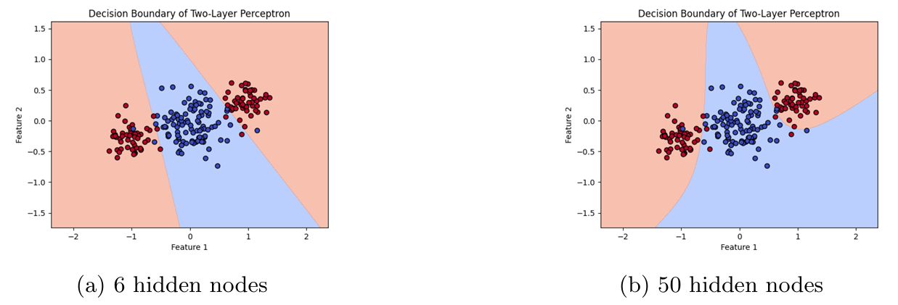
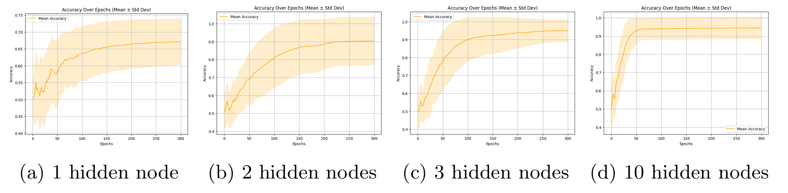
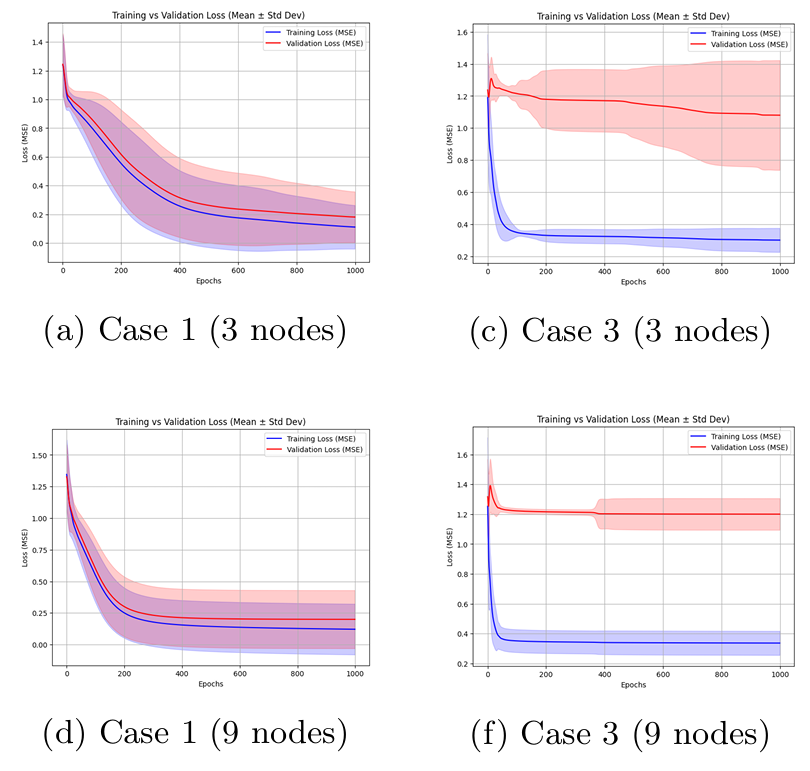
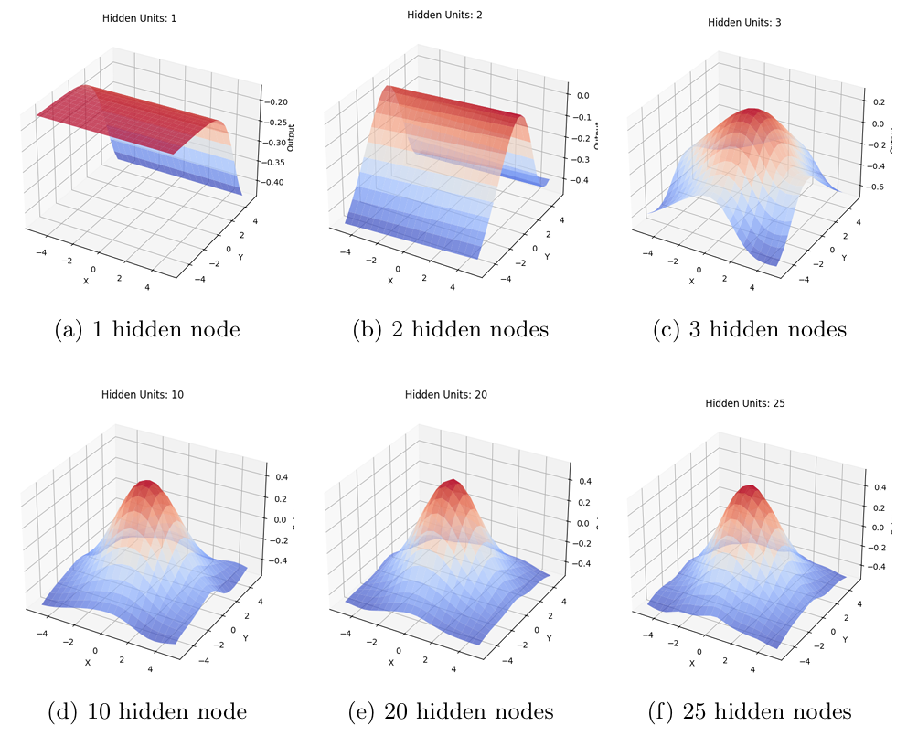
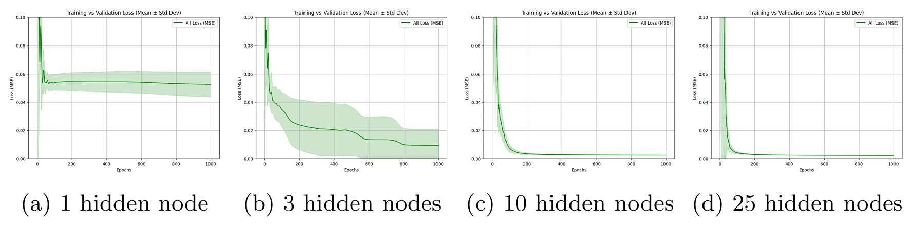

# Multi-Layer Perceptrons for Classification and Function Approximation

## Description

This project explores the use of **multi-layer perceptrons (MLPs)** for supervised learning tasks including binary classification and function approximation. The models are trained using **backpropagation** and evaluated for their ability to learn underlying patterns and generalize to unseen data.

A custom MLP implementation is used to investigate how model architecture, training strategy, and regularization influence performance. Experiments were conducted on **datasets of varying complexity and class imbalance**, to test the model's robustness under different learning conditions.


## Key Results

- **Hidden Layer Size**: Increasing the number of hidden nodes improves learning capacity, especially in early stages, but benefits saturate beyond a moderate size. Smaller networks can still perform competitively if the data is well-separated.
  
- **Learning Mode**: Sequential (online) training often yields better generalization than batch learning. The added stochasticity acts as a form of implicit regularization, especially beneficial in low-data or noisy settings.

- **Overfitting & Generalization**: Larger networks are more prone to overfitting, particularly on inconsistent or undersampled datasets. Early stopping based on validation loss effectively prevents this.

- **Function Approximation**: The MLP generalizes well to continuous target functions even when trained on sparse inputs. Output smoothness improves with network capacity, but excessive complexity can introduce instability.

- **Learning Dynamics**: Adaptive learning rates and momentum significantly accelerate convergence without compromising accuracy.


## Visual Insights

<p align="center">
  
</p>

*Classification decision boundary for two hidden sizes.*

<p align="center">
  
</p>

*Accuracy over epochs for increasing hidden sizes in classification.*

<p align="center">
  
</p>

*Classification learning curves for two datasets (Case 1 balanced and simple, Case 3 more complex and imbalanced) using two different hidden layer sizes.*

<p align="center">
  
</p>

*Function approximation for different MLP architectures.*

<p align="center">
  
</p>

*Function approximation performance for different MLP architectures.*

(See notebook for full visualizations.)

## Features

- Custom MLP implementation using NumPy
- Configurable batch vs. sequential learning
- Momentum and learning rate scheduling
- Early stopping based on validation error
- Performance evaluation on classification and regression tasks

## Datasets

- **Classification**: Synthetic 2D Gaussian clusters
- **Function Approximation**: Smooth surfaces generated from known mathematical functions

## File Structure

- `notebook.ipynb` – Main notebook with models, experiments, and visualizations


## Methodology

- **Architecture**:
  - Single hidden layer MLP with sigmoid activations
  - Linear output for regression tasks

- **Training**:
  - Backpropagation with momentum
  - Adaptive learning rates
  - Early stopping using validation MSE

- **Evaluation**:
  - Accuracy and classification error rate
  - Mean Squared Error (MSE) for regression tasks
  - Experiments with different hidden sizes and learning modes

## Installation

Install dependencies with:

```bash
pip install numpy matplotlib
