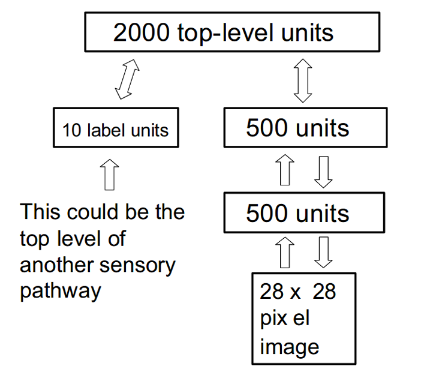
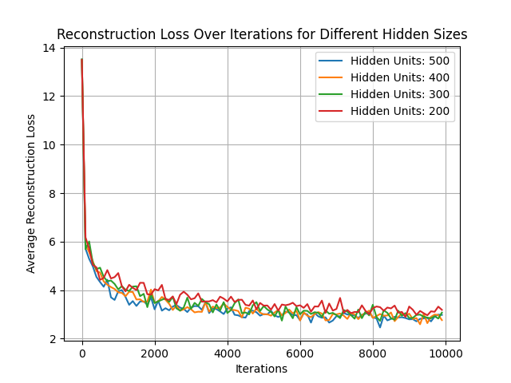
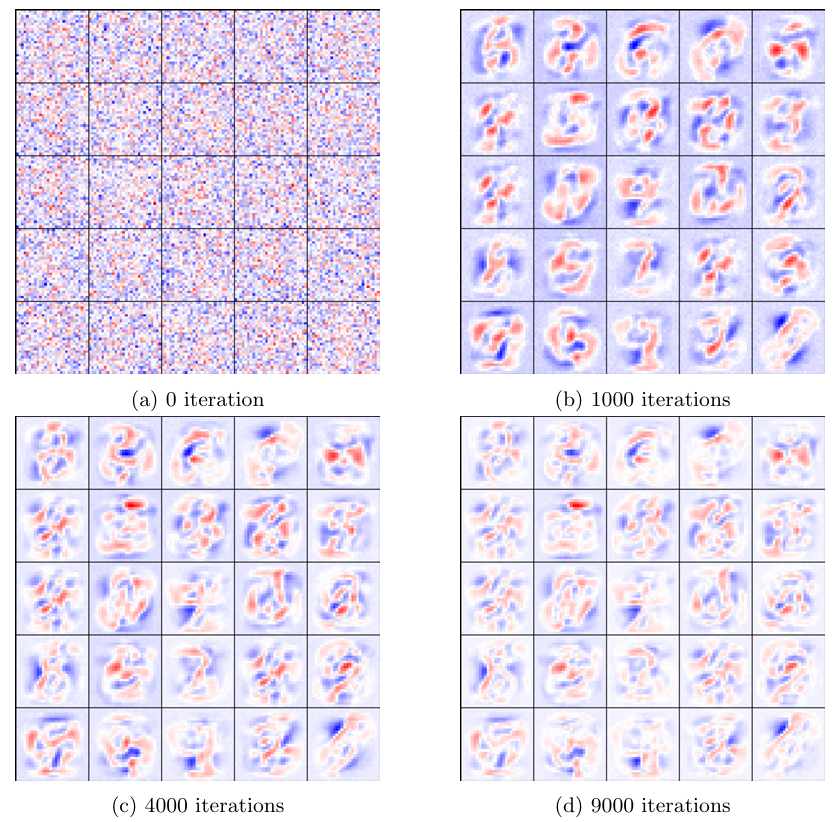
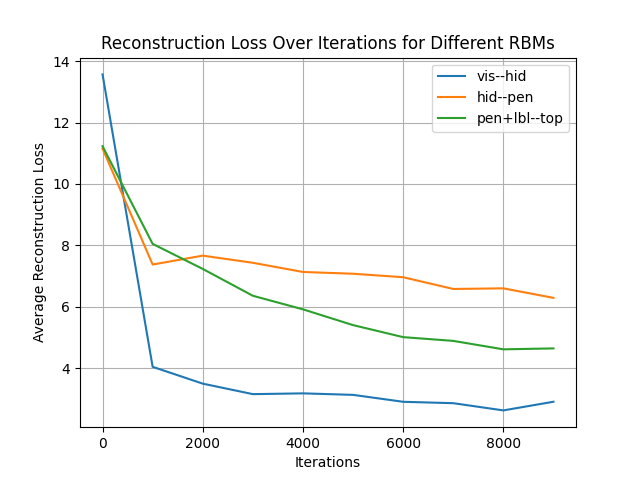

# Deep Belief Networks (DBNs) with Restricted Boltzmann Machines

## Description

This project implements a **Deep Belief Network (DBN)** composed of stacked **Restricted Boltzmann Machines (RBMs)** for unsupervised feature learning and generative modeling. Each RBM is trained individually using **Contrastive Divergence (CD-1)** in a greedy, layer-wise fashion, enabling the DBN to capture increasingly abstract representations from raw input.

The implementation is based on Hinton et al.'s foundational work:  
*A Fast Learning Algorithm for Deep Belief Nets* (2006).  

Our experiments focus on the MNIST dataset, where we assess reconstruction quality, training stability, classification accuracy, and generative capacity. We analyze how design choices (such as hidden layer sizes, learning rates, and momentum) impact learning dynamics.

<p align="center">
  
</p>

*Deep belief network architecture (source: Hinton et al.).*

## Key Results

- **Layer-wise Pretraining**: Stacked RBMs learned meaningful features without supervision. Lower layers captured localized structures, while deeper layers responded to more abstract configurations.
  
- **Reconstruction Quality**: Reconstruction loss decreased sharply in early epochs and plateaued after stabilization. Larger hidden layers improved expressiveness but introduced more fluctuations due to stochasticity.

- **Visual Representations**: Receptive fields showed how RBM hidden units became selective to distinct image patterns (e.g., digit strokes), validating their interpretability.

- **Classification Performance**: A simple classifier on top of the learned representations achieved **88.11%** training and **88.21%** test accuracy without any fine-tuning. This highlights the richness of the representations even in an unsupervised setup.

- **Generative Power**: DBNs successfully synthesized recognizable digits using Gibbs sampling in the top layer. While early iterations produced noisy results, convergence around 200–400 iterations yielded coherent digit shapes for all classes.

## Visual Insights

### RBM for recognizing MNIST digits

<p align="center">
  
</p>

*Reconstruction loss during training for RBMs with various hidden sizes.*

<p align="center">
  
</p>

*Receptive fields of 25 hidden units across training iterations. Patterns emerge and specialize over time.*

### Towards deep networks: greedy layer-wise pretraining

<p align="center">
  
</p>

*Loss curves from unsupervised training of each RBM layer in the DBN stack.*

<p align="center">
  
</p>

*Digit generation over alternating Gibbs sampling steps in the top RBM layer.*

## Features

- Fully custom NumPy implementation of RBMs and DBNs
- Binary stochastic units and Gibbs sampling
- Contrastive Divergence (CD-1) for unsupervised learning
- Modular training pipeline with stacked RBMs
- Support for digit classification and image generation

## Datasets

- **MNIST dataset** (binarized)
- No external loaders used, handled directly in NumPy
- Input size: 784 (28×28 pixels)

## File Structure

- `dbn.py` — Deep Belief Network class and unsupervised stacking
- `rbm.py` — RBM model and training logic
- `run.py` — Entry point for training and evaluation
- `util.py` — Helper utilities (e.g., visualization, sampling)

## Methodology

- **RBM Model**:
  - Hidden and visible units: Binary, stochastic

- **Contrastive Divergence (CD-1)**:
  - One-step Gibbs sampling
  - Weight update rule:

    $$
    \Delta W = \eta \left( \langle v h^\top \rangle_{\text{data}} - \langle v h^\top \rangle_{\text{model}} \right)
    $$

- **DBN Training**:
  - Greedy layer-wise unsupervised training
  - Output of one RBM becomes the input to the next
  - No fine-tuning; classification performance evaluated on frozen features

- **Generation**:
  - Gibbs sampling in the topmost RBM
  - Initialization from class-specific binary vectors
  - Approximate convergence reached after ~200 iterations

## Installation

Install the required dependencies:

```bash
pip install numpy matplotlib
