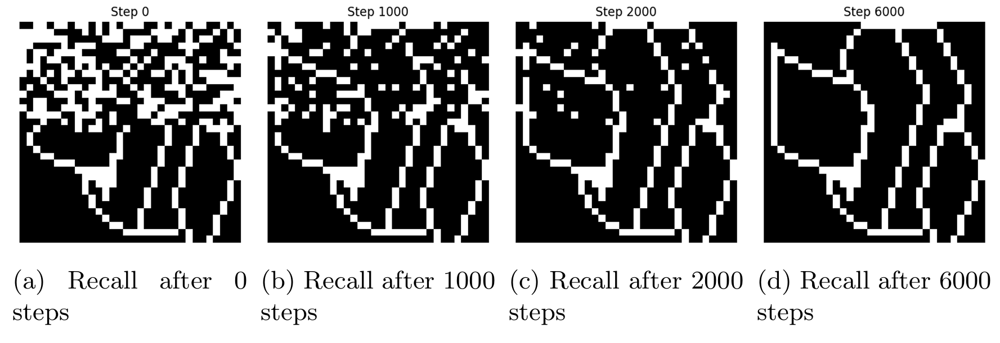
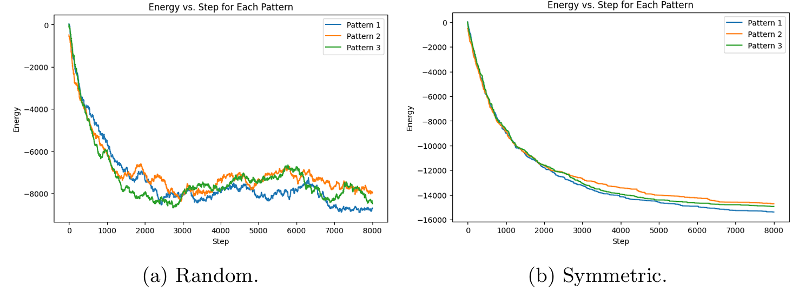
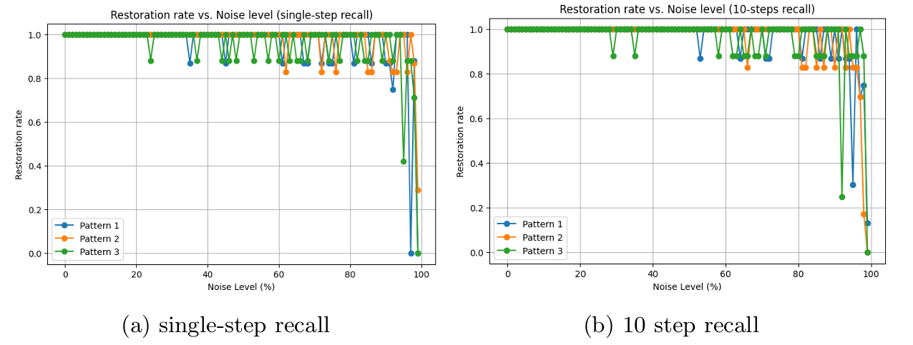
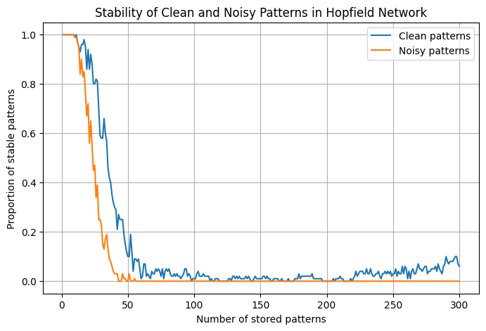
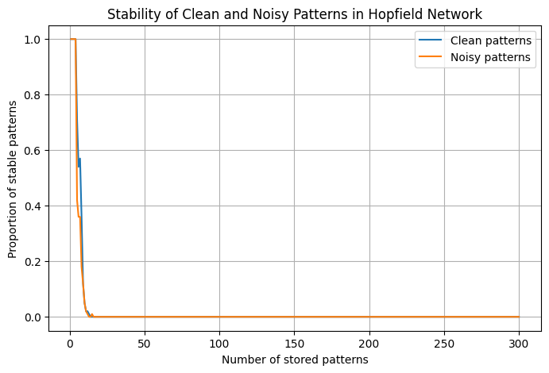
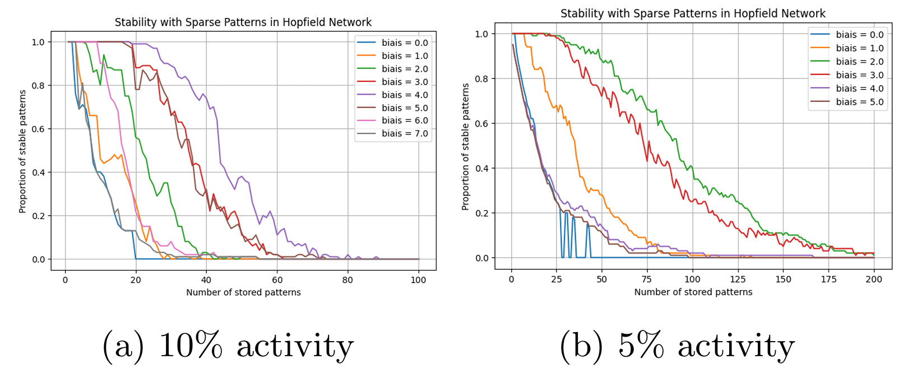

# Hopfield Networks for Associative Memory

## Description

This project explores the behavior and capabilities of **Hopfield networks** as associative memory systems. Using Hebbian learning, the network stores binary patterns and retrieves them from noisy or incomplete inputs. The experiments demonstrate pattern convergence, robustness to distortion, energy dynamics, memory capacity, and the effect of sparsity and correlation on storage limits.

Patterns were stored and recalled using both synchronous (little model) and asynchronous (original Hopfield) update mechanisms. The network was tested on small manually defined patterns as well as larger image-based ones (32×32), with both random and structured content.

## Key Results

- **Pattern Completion**: The network successfully recalled original memory patterns from inputs with up to 25–60% noise, depending on the pattern and update method. Spurious attractors were observed with high distortion.
  
- **Update Dynamics**: Synchronous updates reached convergence almost immediately. Asynchronous updates required significantly more iterations but showed smoother energy descent and progressive error correction.

- **Energy Function**: The energy decreased over time with symmetric weight matrices, validating convergence toward stable attractors. Breaking symmetry led to non-converging oscillations.

- **Memory Capacity**: Capacity was limited for correlated patterns like images but improved significantly with random, orthogonal patterns. In the latter case, the network reached the theoretical capacity limit of approximately $0.138n$ stable patterns.

- **Sparsity**: Sparse binary patterns, when combined with an appropriate bias term, allowed storage of a larger number of patterns (up to ~20), showcasing higher capacity with reduced overlap.

## Visual Insights

<p align="center">
  
</p>

*Progressive convergence of the stored pattern.*

<p align="center">
  
</p>

*Energy descent over updates for symmetric and random matrices.*

<p align="center">
  
</p>

*Restoration rate across increasing noise levels for different recall strategies.*

<p align="center">
  
</p>

*Proportion of stable patterns as a function of the number of stored patterns in a 100-unit network.*

<p align="center">
  
</p>

*Proportion of stable **biased** patterns as a function of the number of stored patterns in a 100-unit network.*

<p align="center">
  
</p>

*Proportion of stable **sparse** patterns (with two activity levels) as a function of the number of stored patterns in a 100-unit network, tested under varying bias values.*

(See notebook for full visualizations.)

## Features

- Custom Hopfield network with Hebbian learning
- Binary and bipolar neuron activation
- Synchronous and asynchronous updates
- Energy tracking and attractor analysis
- Evaluation of robustness, capacity, and sparsity handling

## Datasets

- **Small-scale patterns**: Hand-defined 8-bit binary vectors
- **Large-scale patterns**: 1024-bit images from `pict.dat`, including corrupted and mixed versions
- **Synthetic random patterns**: For testing orthogonal memory capacity

## File Structure

- `notebook.ipynb` — Interactive notebook with implementation and experiments  
- `pict.dat` — Dataset containing large binary patterns (e.g., 32×32 images) 


## Methodology

- **Learning Rule** (Hebbian):

  $$
  w_{ij} = \frac{1}{N}\sum_{\mu=1}^{P} x_i^\mu x_j^\mu
  $$

- **Recall Rule**:

  $$
  x_i \leftarrow \text{sign} \left( \sum_j w_{ij} x_j \right)
  $$

- **Energy Function**:

  $$
  E = - \sum_{i} \sum_j w_{ij} x_i x_j
  $$

- **Sparse Learning**: Adjusted rule using mean activity $\rho$ and a bias threshold $\theta$

- **Evaluation**:
  - Fixed point detection
  - Energy plots across iterations
  - Restoration rate vs. noise level
  - Stability curves vs. number of stored patterns


## Installation

Install the required packages using:

```bash
pip install numpy matplotlib
