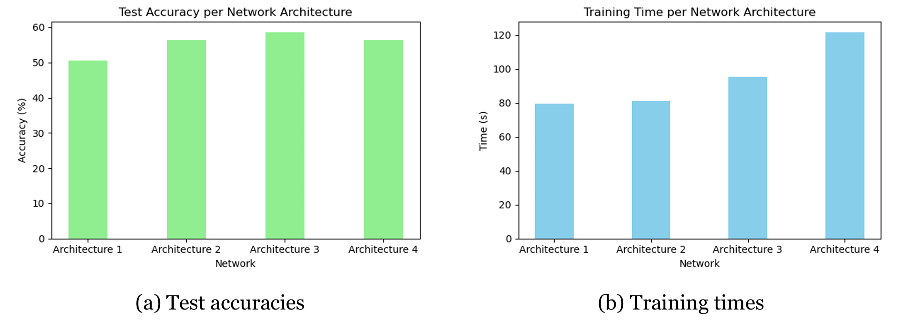
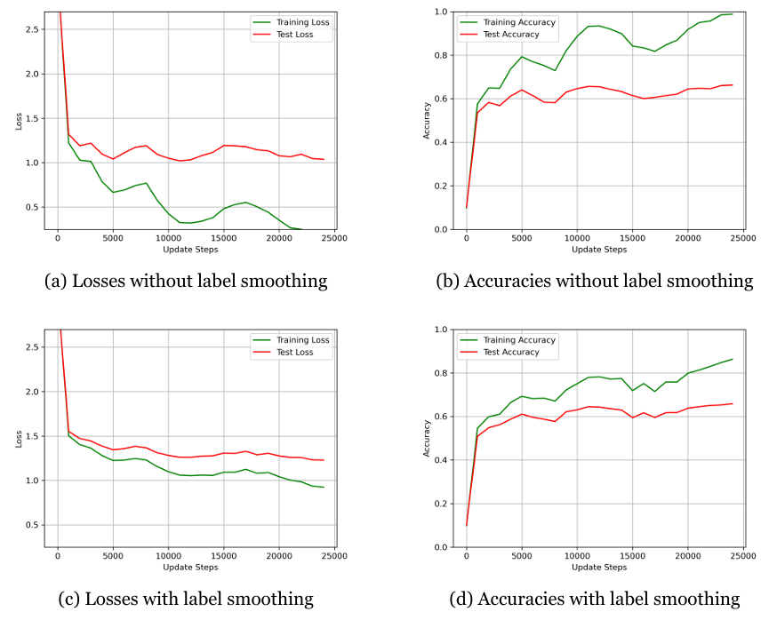
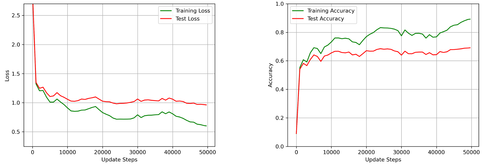

# Image Classification with a Convolutional Neural Network

## Description

This project investigates the manual construction and training of a **convolutional neural network (CNN)** using only NumPy, without relying on deep learning frameworks. The focus is on understanding the mechanics of:

- Convolution and pooling operations
- Forward and backward passes
- Analytical gradient computations (validated against PyTorch)
- Cyclical learning rate schedules
- Label smoothing for regularization
- Offline data augmentation for generalization

To improve computational efficiency, convolutions are implemented using **matrix multiplications** via im2col-style reshaping, which significantly accelerates forward and backward computations.

The CNN was trained on the **CIFAR-10** dataset, and different architectures and training strategies were tested to evaluate performance and training efficiency.


## Key Results

- **Analytical Gradients**: Gradient validation against PyTorch showed extremely low relative errors (∼$10^{-7}$), confirming implementation correctness.
- **Model Scaling**: Increasing filter size and number of filters generally improved test accuracy, but with increased training time. A trade-off was achieved with moderately sized models.
- **Step Scheduling**: Cyclical learning rates with expanding step sizes improved convergence and final performance.
- **Label Smoothing**: Reduced overfitting by narrowing the train/test gap in deeper networks.
- **Best Architecture**: Achieved **69.13% test accuracy** using a model with 60 filters and 300 hidden units, label smoothing, and data augmentation.

| Architecture | Filter Size (f) | Filters (nf) | Hidden Units (nh) | Training Acc | Validation Acc | Test Acc |
|--------------|-----------------|--------------|--------------------|---------------|----------------|----------|
| Arch. 1      | 2               | 3            | 50                 | 54.38%             | 51.10%             | 50.49%   |
| Arch. 2      | 4               | 10           | 50                 | 61.61%             |   56.3%            | 56.41%   |
| Arch. 3      | 8               | 40           | 50                 | **63.47%**             | **58.70%**              | **58.59%**   |
| Arch. 4      | 16              | 160          | 50                 | 62.98%             | 57.10%              | 56.44%%   |
*Performance with four different architectures after short training runs.*

| Architecture | Width (nf) | Hidden (nh) | Training Acc | Validation Acc | Test Acc | 
|--------------|------------|-------------|---------------|----------------|----------| 
| Final model | 60 | 300 | 89.19% | 70.80% | 69.13% |
*Performance with the best-performing model (including learning rate decay, label smoothing, weight decay, and offline data augmentation) after a longer training run.*


### Training Time Comparison

| Architecture | Description                                 | Custom Impl. (s) | PyTorch (s) |
|--------------|---------------------------------------------|------------------|-------------|
| Arch. 1      | 2×2 filter, 3 filters, 50 hidden units      | 93.99            | **87.41**       |
| Arch. 2      | 4×4 filter, 10 filters, 50 hidden units     | 96.16            | **81.48**       |
| Arch. 3      | 8×8 filter, 40 filters, 50 hidden units     | 99.18            | **86.62**       |
| Arch. 4      | 16×16 filter, 160 filters, 50 hidden units  | 132.93           | **114.21**      |
| Arch. 5      | 4×4 filter, 10 filters, 100 hidden units     | **100.29**           | 129.95      |
| Arch. 6      | 4×4 filter, 10 filters, 200 hidden units    | **117.75**           | 229.58      |
| Arch. 7      | 16×16 filter, 160 filters, 200 hidden units    | **149.57**           | 258.18      |

> Note: PyTorch is faster for shallow models but tends to be slower when the fully connected layers are wide.

## Visual Insights

<p align="center">
  
</p>

*Test accuracies and training times for multiple network architectures (previously described).*

<p align="center">
  
</p>

*Training dynamics with and without label smoothing.*

<p align="center">
  
</p>

*Loss and accuracy curves for the best-performing model.*

## Features

- Fully custom NumPy implementation of:
  - 1D convolution
  - Max pooling
  - Fully connected layers
- Cyclical learning rate with step expansion and decay
- Label smoothing for improved generalization
- Offline data augmentation (horizontal flips and translations)
- Training time benchmarking against PyTorch

## Datasets

- **CIFAR-10**: 32x32 RGB images across 10 classes.
  - Training: 49,000 samples
  - Validation: 1,000 samples
  - Test: 10,000 samples
  - +24,500 augmented training images (via flipping and translation)

## File Structure

- `notebook.ipynb` – Main training and experimentation notebook
- `torch_gradient_computations.py` – Gradient validation with PyTorch
- `data/` – CIFAR-10 dataset files

## Methodology

- **Architecture**:
  - One convolutional layer
  - Two fully connected layers
  - Softmax output for 10-class classification

- **Training**:
  - Mini-batch gradient descent
  - Cyclical learning rate with optional decay
  - L2 weight decay

- **Regularization**:
  - Label smoothing with $\epsilon = 0.1$

- **Evaluation**:
  - Accuracy on training, validation, and test sets
  - Loss and accuracy curves
  - Training time comparison with PyTorch

## Installation

Install required packages with:

```bash
pip install numpy matplotlib torch