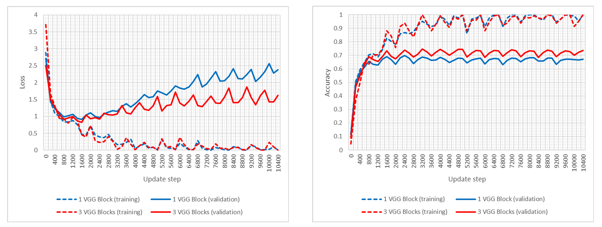
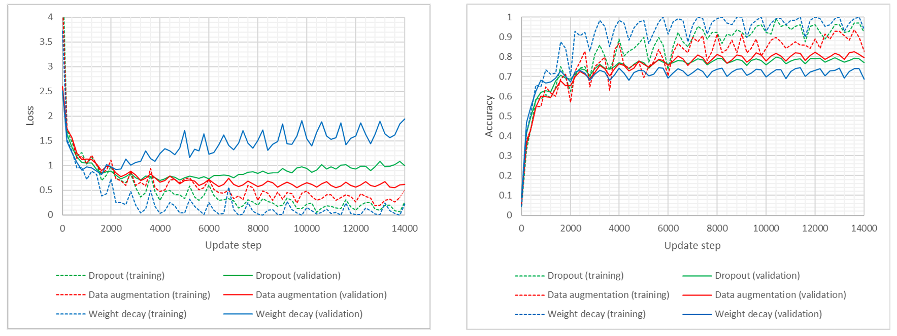
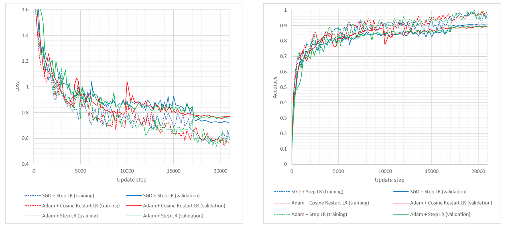
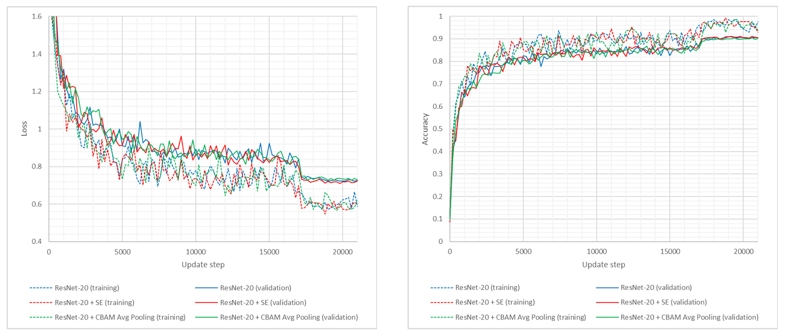

# CNN Architectures for Image Classification: From VGG to ConvNeXt

## Description

This project investigates the training of convolutional neural networks (CNNs) **from scratch** on popular image classification benchmarks, including **CIFAR-10**, **CIFAR-100**, and **ImageNette**. We begin with a simple **VGG-style** baseline and progressively enhance the network using:

- Regularization strategies: dropout, weight decay, label smoothing
- Architectural improvements: batch normalization, global average pooling
- Advanced backbones: **ResNet-20**, **ResNet with SE/CBAM attention**, and **ConvNeXt-Tiny**
- Loss robustness: **Symmetric Cross-Entropy (SCE)** under noisy labels

All experiments are conducted using **PyTorch** with consistent hyperparameter tuning and ablation-based evaluations.

## Key Results

- **Baseline VGG Network**  
  Achieves **73.84%** test accuracy with 3 stacked VGG blocks. Regularization techniques (dropout, data augmentation, batch norm, and label smoothing) lift performance up to **87.56%** on CIFAR-10.

- **ResNet-20 + SE**  
  Improves performance to **90.72%** on CIFAR-10 and **65.81%** on CIFAR-100. SE consistently boosts representational power.

- **CBAM (channel + spatial attention)**  
  Performs slightly worse than SE on both CIFAR-10 (**90.42%**) and CIFAR-100 (**65.54%**). Full CBAM (average + max pooling) underperforms.

- **ConvNeXt-Tiny on ImageNette-10**  
  Achieves **86.42%** Top-1 accuracy using ImageNet-style training on a small subset, confirming its robust transformer-inspired architecture.

- **Robustness to Label Noise (40%)**  
  Symmetric Cross-Entropy (SCE) provides mixed results. In some runs, it improved over CE, but reproducibility was inconsistent. CE reached up to **79.37%**, while SCE peaked at **70.5%** under noise.

## Experimental Overview

### Baseline VGG Models

| Architecture                 | Test Accuracy |
|-----------------------------|---------------|
| 1 VGG Block                 | 69.59%        |
| 3 VGG Blocks                | 73.84%        |
| + Dropout                   | 78.27%        |
| + Weight Decay              | 73.44%        |
| + Data Augmentation         | 82.73%        |
| + BN + Dropout + Augment    | 85.89%        |
| + BN + Dropout + Augment + Label Smoothing           | 86.42%        |
| + BN + Dropout + Augment + GAP Head                  | 87.30%        |
| + BN + Dropout + Augment + GAP + Label Smoothing     | **87.56%**     |

### ResNet & Attention Modules (CIFAR-10 / CIFAR-100)

| Model                             | CIFAR-10 | CIFAR-100 |
|----------------------------------|----------|-----------|
| ResNet-20                        | 90.64%   | 65.46%    |
| + SE                             | **90.72%**   | **65.81%**    |
| + CBAM (Avg Pooling only)        | 90.42%   | 65.54%    |
| + CBAM (Avg + Max Pooling)       | 89.95%   | 65.00%    |

### ConvNeXt-Tiny (ImageNette)

| Model               | Dataset        | Accuracy |
|--------------------|----------------|----------|
| ConvNeXt-Tiny (ours)      | ImageNette-10 | **86.42%** |
| ConvNeXt-Tiny (orig) | ImageNet-1K   | 84.10%   |
| ConvNeXt-Large (orig)       | ImageNet-1K   | 86.60%   |

### Robust Loss Evaluation (CIFAR-10, 40% Noise)

| Loss Function    | Test Accuracy |
|------------------|---------------|
| Cross-Entropy    | **79.37%**    |
| Symmetric CE     | 70.50%        |

> While SCE sometimes outperformed CE in isolated runs, it lacked consistency and generalizability in this setting.

## Visual Insights

<p align="center">
  
</p>

*Loss (left) and accuracy (right) with two baseline VGG-based networks and a cyclical learning rate on CIFAR-10.*


<p align="center">
  
</p>

*Loss (left) and accuracy (right) with a 3-VGG blocks network and different regularization strategies on CIFAR-10.*

<p align="center">
  
</p>

*Loss (left) and accuracy (right) with our ResNet-20 and multiple training configurations on CIFAR-10.*

<p align="center">
  
</p>

*Loss (left) and accuracy (right) with our ResNet-20 and its extensions on CIFAR-10.*


## Features

- VGG-style networks with modular blocks
- Residual networks with identity or projection shortcuts
- Channel and spatial attention modules (SE, CBAM)
- Modern transformer-inspired CNNs (ConvNeXt)
- Training under symmetric label noise
- Robust evaluation and regularization pipelines

## Datasets

- **CIFAR-10**: 60,000 images, 10 classes  
- **CIFAR-100**: 60,000 images, 100 classes  
- **ImageNette-10**: ~13,000 images, 10 classes (subset of ImageNet-1K at 160px)

All images undergo standard preprocessing (normalization, augmentation with flips and crops).

## File Structure

- `main.py` – Pipeline runner for selected architectures
- `config.py` – Configuration settings and model parameters
- `utils.py` – Training, evaluation, and augmentation utilities
- `report.pdf` – Detailed and exhaustive explanation of model, methods, experiments, and results
- `papers/` – Reference papers consulted for the implementation

> Note: The provided code does not include the ConvNeXt implementation and the loss robustness assessment.


## Methodology

- **Training**:
  - Optimizers: AdamW, SGD + momentum
  - Learning rate schedules: cyclic, step decay, cosine annealing
  - Batch size and epoch counts adjusted per dataset
  - Weight initialization: He Initialization (ReLU-suitable)

- **Regularization**:
  - Data augmentation (random crop, flips, translations)
  - Dropout and label smoothing
  - Global average pooling heads (replacing FC layers)

- **Evaluation**:
  - Top-1 accuracy on validation/test splits
  - Learning curves tracked for all experiments
  - All models trained from scratch (no pretraining)

## Installation

```bash
pip install torch torchvision matplotlib