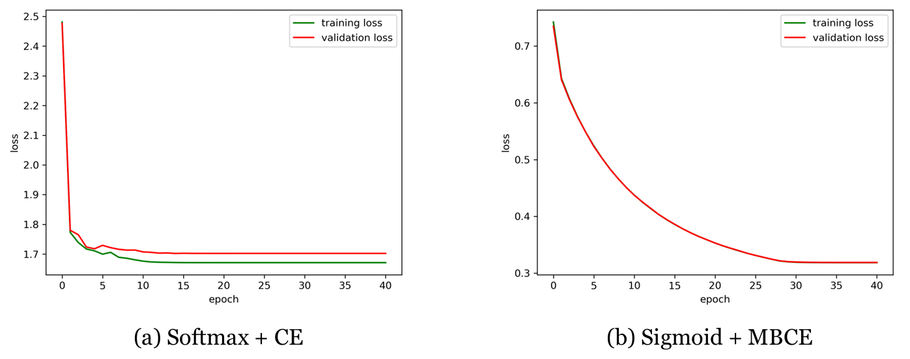

# Image Classification with a 1-layer network

## Description

This project implements and analyzes a **fully connected 1-layer neural network** for image classification on the **CIFAR-10** dataset. The goal is to ensure the correctness of the backpropagation implementation and explore how training behavior is affected by different hyperparameters, training strategies, and loss formulations. The network is trained using vanilla mini-batch gradient descent, with two loss options: **categorical cross-entropy with Softmax** and **multiple binary cross-entropy (MBCE) with Sigmoid**. 

Experiments include:
-   Verification of analytical gradients through comparison with PyTorch numerical implementations.
-   Analysis of training dynamics under different learning rates and regularization strengths.  
-   Assessment of generalization using training and validation performance metrics.
-   Evaluation of training strategies such as data augmentation, learning rate scheduling, and grid search for hyperparameter tuning.    
-   Comparison between loss functions, focusing on the generalization behavior of MBCE versus traditional cross-entropy.

## Key Results

- **Analytical Gradients**: Gradient computations with respect to both weights and biases were validated with relative errors in the range of $10^{-15}$, confirming correctness.
  
- **Parameter Sensitivity**:
  - A **high learning rate** ($\eta$=0.1) led to instability and divergence.
  - Increasing **L2 regularization** ($\lambda$) helped reduce overfitting (reduced the gap between training and test accuracies) but degraded performance when too large.

| Configuration                      | Learning Rate ($\eta$) | L2 Reg ($\lambda$) | Training Acc   | Test Acc |
|-----------------------------------|--------------------|------------|----------------|----------------|
| Setting 1                | 0.1               | 0.0        | 43.43%  | 28.42%         |
| **Setting 2**                      | **0.001**                | **0.0**        | **45.54%**   | **39.92%**         |
| Setting 3           | 0.001               | 0.1      | 44.73%  | 39.40%         |
| Setting 4           | 0.001               | 1      | 40.14%  | 37.38%         |4

*Final classification accuracy across various training configurations (without additional optimization techniques).*

- **Optimization Strategies**: Using a larger training set, learning rate decay, grid-search optimization of hyperparameters, and light data augmentation further improved generalization and narrowed the train/test accuracy gap.

- **Loss Comparison**: MBCE loss with Sigmoid output exhibited smaller generalization gaps and smoother learning dynamics compared to traditional Softmax+CE, making it more robust to overfitting.

| Loss Function     | Training Acc | Test Acc |
|-------------------|-------------------|----------------|
| **Softmax + CE**      | **43.57%**            | **42.17%**         |
| Sigmoid + MBCE    | 41.85%            | 41.06%         |

*Final classification accuracy across various training configurations (with the previously mentioned additional optimization techniques).*


## Visual Insights

<p align="center">
  
</p>

*Training and validation losses across settings with different learning rates and regularization.*

<p align="center">
  
</p>

*Visualization of learned weight matrices: clearer features emerge with increased regularization.*

<p align="center">
  
</p>

*Training and validation losses across two different training procedures.*

<p align="center">
  
</p>

*Prediction confidence histograms for correct and incorrect classifications (CE vs MBCE).*

## Features

- Gradient validation using numerical checks
- Modular code with PyTorch-based gradient computation
- Support for Softmax + Cross-Entropy and Sigmoid + MBCE losses
- Learning rate decay and L2 regularization
- Evaluation of training dynamics and test performance


## Datasets

- **CIFAR-10**: A labeled dataset of 60,000 32×32 RGB images in 10 classes
- Training on flattened and normalized image vectors (3072-dimensional inputs)
- Experiments conducted with batch size 100
- Optional data augmentation (e.g., horizontal flipping) to improve generalization


## File Structure

- `torch_gradient_computations.py` – Implements two gradient routines with CE and MBCE losses using PyTorch.
- `notebook.ipynb` — Main interactive notebook with implementation, experiments, and full visualizations .
- `data/` – CIFAR-10 dataset files

## Methodology

- **Forward Pass**: Scores are computed as  $s = Wx + b$, followed by Softmax or Sigmoid.
  
- **Loss Functions**:
  - Cross-entropy with Softmax:
    
    $\text{CE} = -\log P(y \mid x)$
    
  - MBCE with Sigmoid:
    
    $\text{MBCE} = - \frac{1}{K} \sum_{k=1}^{K} \left[ y_k \log(p_k) + (1 - y_k) \log(1 - p_k) \right]$

- **Gradient Computation**:
  
  Verified using numerical gradients and PyTorch's automatic differentiation:
  $\frac{\partial \mathcal{L}}{\partial W}, \quad \frac{\partial \mathcal{L}}{\partial b}$

- **Training**:
  - Mini-batch gradient descent
  - Grid search over $\eta$ and $\lambda$
  - Learning rate decay when validation loss plateaus

## Installation

Install dependencies with:

```bash
pip install numpy torch
