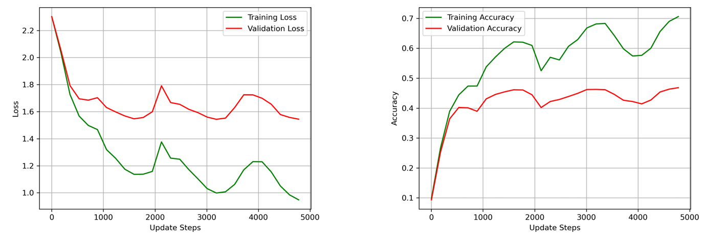
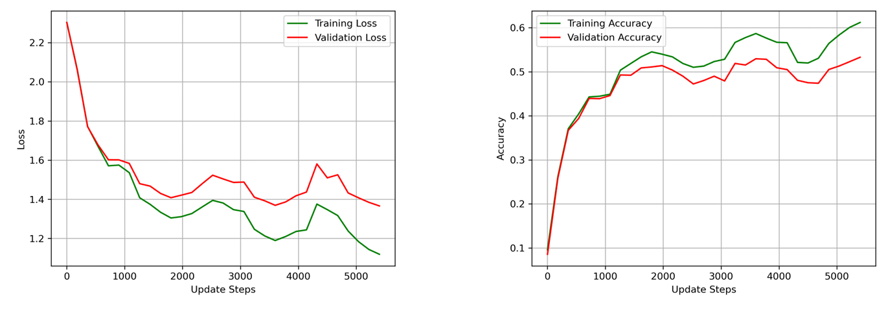
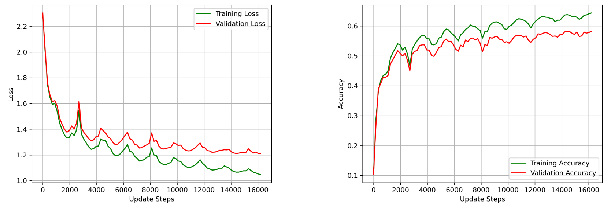
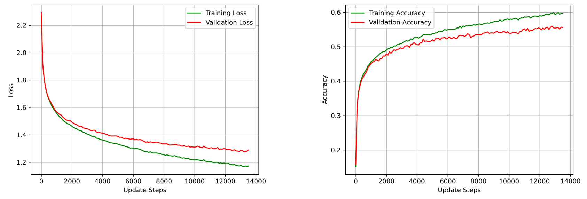

# Image Classification with a 2-Layer Neural Network

## Description

This project focuses on training a fully connected **2-layer neural network** for image classification on the **CIFAR-10** dataset. The primary objective is to validate analytically computed gradients via numerical checks and investigate how training performance evolves with different regularization values and optimization strategies.

The model is trained using **mini-batch gradient descent** with either a **cyclical learning rate schedule** or the **Adam optimizer**. Extensive experiments were conducted to evaluate the impact of regularization strength, data augmentation, dropout, and other hyperparameters on test accuracy and generalization.

## Key Results

- **Gradient Validation**: Analytical gradients were verified through comparison with numerical gradients, showing relative errors as low as $10^{-15}$, confirming correctness.

- **Regularization Effects**: A random search over $\lambda$ (L2 regularization) revealed that small regularization values led to improved validation performance. A random search led to optimal values near $\lambda=10^{-5}$.

- **Cyclical Learning Rate**: Training with a cyclical schedule revealed distinct performance phases tied to learning rate peaks. Smaller learning rates yielded more stable improvements, while higher peaks occasionally degraded performance.

- **Generalization**: Using more data (49,000 training samples) and light data augmentation significantly improved test accuracy and reduced overfitting.

- **Performance Improvements**:
  - **Wider networks** (150 hidden units) led to substantial accuracy gains.
  - **Dropout** (with a probability $p=0.2$) helped narrow the gap between training and test accuracy.
  - **Data Augmentation** via flips and shifts improved robustness and generalization.
  - **Learning Rate Decay** (with a factor $\rho = 0.8$) refined convergence over cycles.

### Performance Summary

| Strategy                  | Training Acc | Validation Acc | Test Acc |
|---------------------------|-----------|---------|----------|
| Best with Cyclical LR     | 64.34%    | 58.20%  | 57.69%   |
| Best with Adam Optimizer  | 59.66%    | 55.62%  | 55.05%   |

*Test accuracy comparison of best-performing models trained with different strategies.*

## Visual Insights

<p align="center">
  
</p>

*Loss (left) and accuracy (right) with a cyclical learning rate and no regularization.*


<p align="center">
  
</p>

*Loss (left) and accuracy (right) with a cyclical learning rate and L2 regularization ($\lambda=1.608 \times 10−5$).*


<p align="center">
  
</p>

*Loss (left) and accuracy (right) for the best-performing model with a cyclical learning rate.*


<p align="center">
  
</p>

*Loss (left) and accuracy (right) for the best-performing model with Adam Optimizer.*

## Features

- Gradient validation using PyTorch-based numerical methods
- Fully connected 2-layer network with customizable size
- Training with mini-batch SGD, cyclical LR, or Adam
- Dropout and data augmentation for regularization
- Grid/random search over hyperparameters

## Datasets

- **CIFAR-10**: 32x32 RGB images across 10 classes.
  - Training: 49,000 samples (with optional augmentation)
  - Validation: 1,000 samples
  - Test: 10,000 samples

## File Structure

- `torch_gradient_computations.py` — Computes gradients for a fully connected neural network using PyTorch's autograd functionality.
- `notebook.ipynb` — Contains all training experiments, visualization, and evaluation routines.
- `data/` – CIFAR-10 dataset files

## Methodology

- **Forward Pass**:
  - First layer: Linear → ReLU
  - Second layer: Linear → Softmax
  - Scores computed as:  
    $$
    s = W_2 \cdot \text{ReLU}(W_1 x + b_1) + b_2
    $$

- **Loss**:
  - Categorical cross-entropy loss:
    $$
    \mathcal{L} = -\log P(y \mid x)
    $$

- **Gradient Computation**:
  - Backpropagation used for exact gradients
  - Validated against numerical approximations:
    $$
    \frac{\partial \mathcal{L}}{\partial W_1}, \quad \frac{\partial \mathcal{L}}{\partial W_2}, \quad \frac{\partial \mathcal{L}}{\partial b_1}, \quad \frac{\partial \mathcal{L}}{\partial b_2}
    $$

- **Optimization**:
  - SGD with cyclical learning rate:  
    Learning rate oscillates between $\eta_{\text{min}}$ and $\eta_{\text{max}}$ over cycles.
  - Adam optimizer: Adaptive learning using momentum and squared gradient tracking.

## Installation

To install required packages:

```bash
pip install numpy torch matplotlib