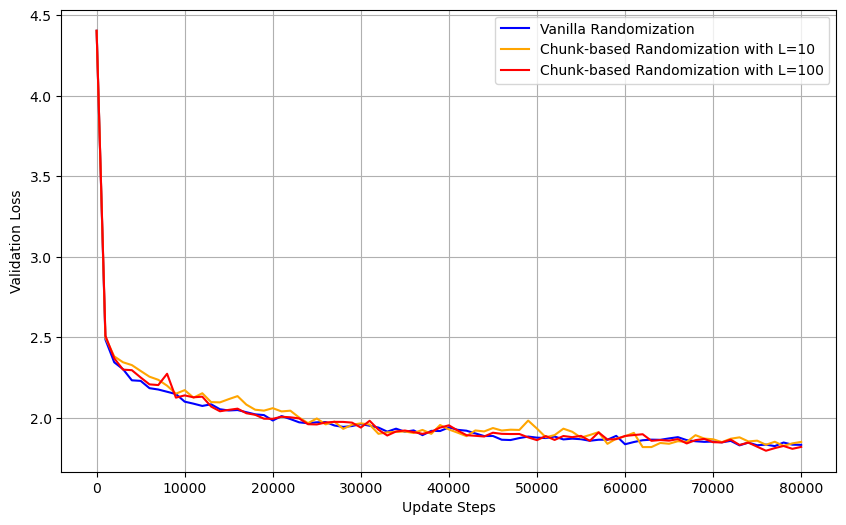
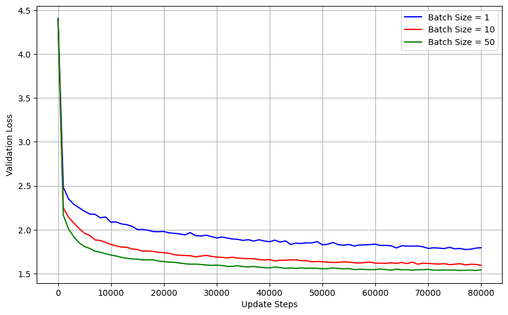
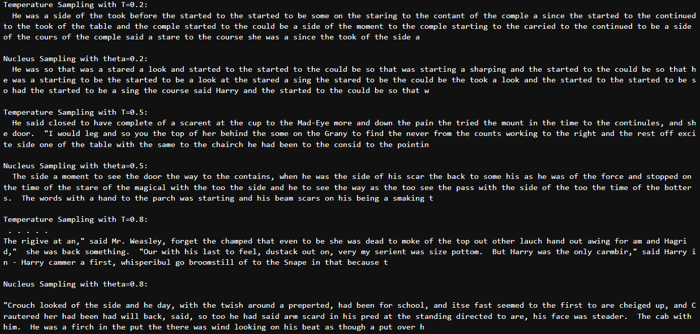

# Character-Level Language Modeling with a Recurrent Neural Network

## Description

This project explores the implementation and training of a **character-level recurrent neural network (RNN)** from scratch using NumPy. The goal is to model character sequences from a literary corpus and generate coherent text by predicting the next character in a sequence.

Key focus areas include:

- Manual implementation of forward and backward passes
- Analytical gradient computations validated against PyTorch
- Training with **Adam optimizer**
- Impact of **batch size** and **sequence randomization** strategies
- Text generation using **temperature-based** and **nucleus sampling**

The model is trained on a cleaned version of *"Harry Potter and the Goblet of Fire"*.

## Key Results

- **Gradient Validation**: Analytical gradients were validated against PyTorch's numerical approximations. Relative errors were in the range of $10^{-16}$, confirming correctness.

- **Training Loss**: The loss decreased significantly within the first epoch, with repeated patterns in the loss curve caused by challenging sections of the book. Most performance gains occurred early in training.

- **Text Generation**:
  - Over training iterations, the generated text improved dramatically in fluency and vocabulary.
  - The best model (trained for 5 epochs with hidden size 200) produced legible and diverse sequences, though coherence at the sentence level remained limited.

- **Randomization Strategies**:
  - **Vanilla randomization** (random sequence start every step) improved convergence smoothness and stability.
  - **Chunk-based randomization** preserved local temporal coherence while introducing shuffle-based diversity, offering a middle ground.

- **Batch Size**:
  - Larger batch sizes (10, 50) led to **smoother** and **faster convergence** and lower final validation loss compared to batch size 1.

- **Sampling Techniques**:
  - **Temperature scaling**: Low temperatures produced repetitive but accurate text; high temperatures yielded more creative but erratic output.
  - **Nucleus sampling**: Allowed control over diversity and coherence through cumulative probability thresholds.

## Visual Insights


<p align="center">
  
</p>

*Smoothed validation loss comparing sequence randomization strategies.*

<p align="center">
  
</p>

*Effect of batch size on validation loss.*

<p align="center">
  
</p>

*Text samples using temperature and nucleus sampling strategies.*

## Features

- Fully custom RNN with NumPy
- Manual gradient computation and Adam optimization
- Configurable:
  - Hidden size
  - Sequence length
  - Batch size
- Supports:
  - Vanilla and chunk-based sequence randomization
  - Softmax sampling with temperature
  - Nucleus sampling
- Gradient validation with PyTorch for correctness

## Dataset

- **Text**: "Harry Potter and the Goblet of Fire" (preprocessed)
- Processed at character level (vocabulary size ~90)
- Training over multiple epochs with sequence length = 25

## File Structure

- `notebook.ipynb` — Main implementation, experiments, and all results
- `goblet_book.txt` — Preprocessed input corpus

## Methodology

- **Forward Pass**:
  - Input characters are embedded as one-hot vectors
  - Hidden state updated via:
    $$
    h_t = \tanh(W h_{t-1} + U x_t + b)
    $$
  - Output scores:
    $$
    o_t = V h_t + c
    $$
  - Softmax over $o_t$ yields character distribution

- **Backward Pass**:
  - Gradients derived manually for all parameters
  - Computed through time (BPTT), up to sequence length

- **Optimization**:
  - Adam with:
    - Learning rate: $\eta = 0.001$
    - $\beta_1 = 0.9$, $\beta_2 = 0.999$, $\epsilon = 10^{-8}$

- **Sampling**:
  - Softmax sampling with optional temperature scaling:
    $$
    p_i = \frac{e^{o_i / T}}{\sum_j e^{o_j / T}}
    $$
  - Nucleus sampling from top-k cumulative probability set

## Installation

Install the required packages:

```bash
pip install numpy matplotlib torch