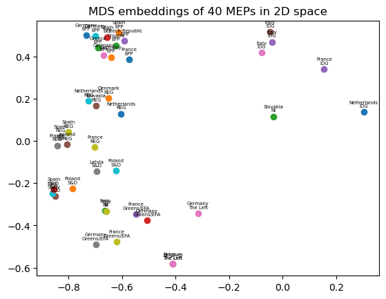
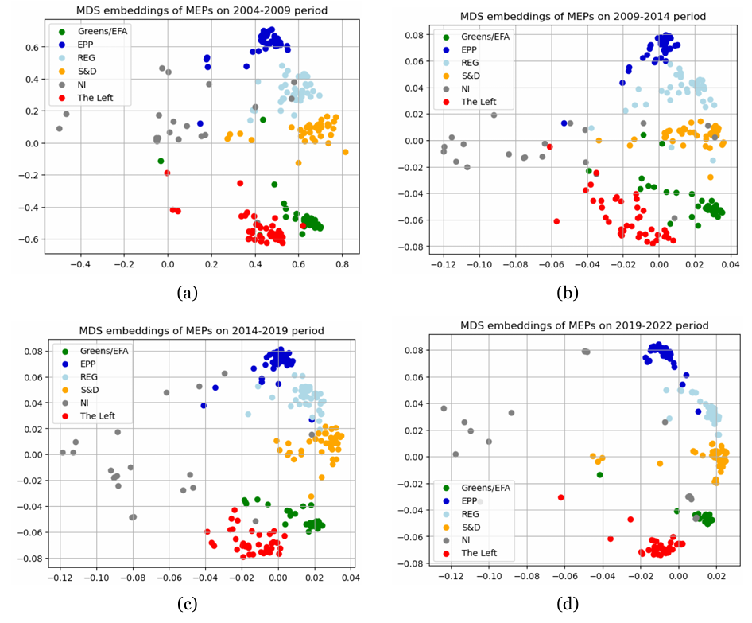
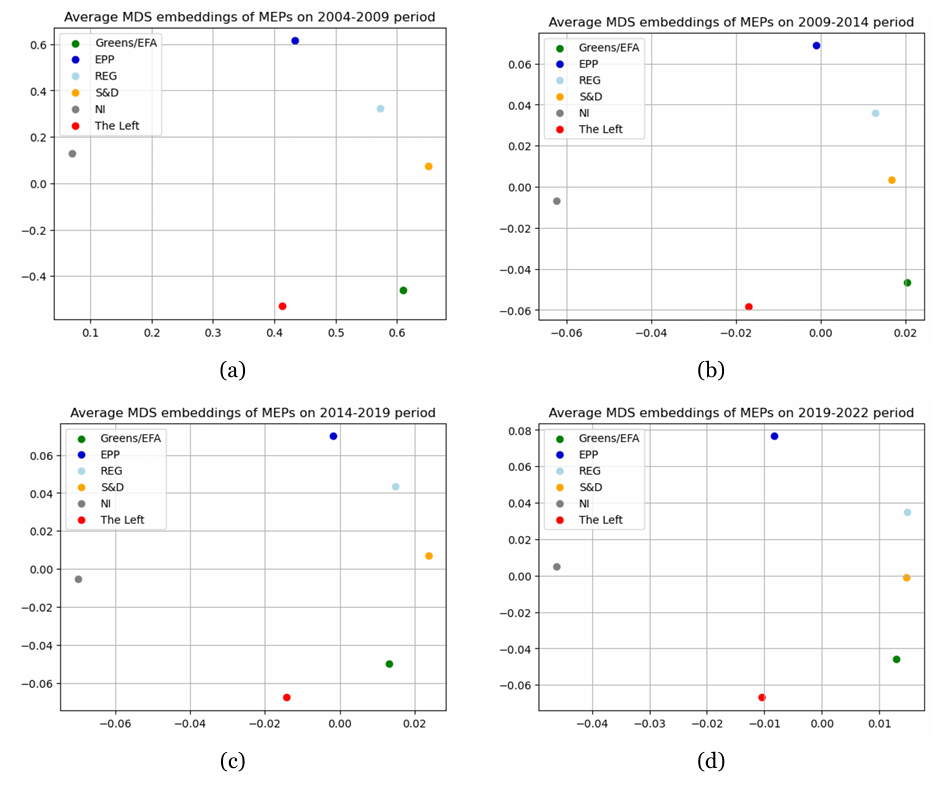

# Dimensionality Reduction for Political Voting Data

## Description

This project analyzes the voting behavior of Members of the European Parliament (MEPs) using **dimensionality reduction techniques**. By modeling MEPs as high-dimensional vectors based on their voting records, we aim to uncover patterns, similarities, and group structures within the European political space.

A custom **voting similarity function** is introduced to quantify alignment between MEPs, accounting for abstentions and missing data. This similarity is then used to compute a dissimilarity matrix, which feeds into **Classical Multidimensional Scaling (MDS)** to generate a 2D spatial representation.

Additionally, we explore how political structure evolves over time by applying MDS to separate temporal segments, and use **Procrustes analysis** to align the resulting embeddings, enabling direct visual comparisons across periods.

## Key Results

- **Voting Similarity**: A custom similarity function based on normalized Hamming distance allowed for meaningful comparison across MEPs while handling sparse and symbolic vote data.
  
- **Dimensionality Reduction**: Classical MDS projections consistently revealed that **European Parliament Group (EPG)** affiliation is more explanatory of voting alignment than **nationality**, indicating ideological structure beyond national borders.

- **Temporal Evolution**: MDS embeddings across four time periods showed shifts in the relative positioning of political groups. Alignment using Procrustes analysis enabled tracking the evolution of ideological blocks, including increasing polarization or fragmentation in certain groups.

## Visual Insights

<p align="center">
  
</p>

*2D projection of 40 MEPs using Classical MDS, annotated with European Parliament Group and nationality.*

<p align="center">
  
</p>

*Time-based MDS embeddings for MEPs across four legislative periods, labeled by EPG.*

<p align="center">
  
</p>

*Average MDS embeddings of EPGs across four legislative periods.*

## Features

- Custom similarity metric designed for sparse, symbolic voting data
- Classical MDS implementation using eigenvalue decomposition of a double-centered distance matrix
- Procrustes analysis for aligning MDS embeddings across different time periods
- Flexible data cleaning and metadata integration
- Color-coded, interpretable visualizations by political group or nationality

## Datasets

- Voting records from the [EUI Cadmus Repository](https://cadmus.eui.eu/handle/1814/74918)
- Each row corresponds to an MEP and their voting behavior across hundreds of issues
- Includes metadata such as:
  - **EPG** (European Parliament Group)
  - **Country** of representation
  - **Session/Time period** of the vote

## Methodology

- **Similarity Function**:
  $$
  Sim(V_i,V_j)=\frac{V_i . V_j}{||V_i||||V_j||}
  $$
  - Only overlapping votes are considered
  - Abstentions and missing entries are excluded

- **Classical MDS**:
  - Eigen-decomposition:
  $$
  S = UDU^T
  $$ where $S$ is the similarity matrix
  - The 2D embedding is derived with:
  $$
  X=I_{2,n} D^{\frac{1}{2}}U^T
  $$

- **Temporal Analysis**:
  - Separate MDS projections computed for each legislative period
  - **Procrustes alignment** applied to align embeddings across time for comparative visualization

- **Evaluation**:
  - Qualitative interpretation of clusters and group cohesion
  - Visualization of group movements over time
  - Identification of ideological outliers or shifts

## File Structure

- `notebook.ipynb` – Full pipeline: data cleaning, similarity computation, MDS, alignment, and visualization
- `data/` – Contains raw data files with MEP voting records

## Installation

To run the notebook, install the required dependencies:

```bash
pip install numpy pandas matplotlib seaborn scikit-learn
