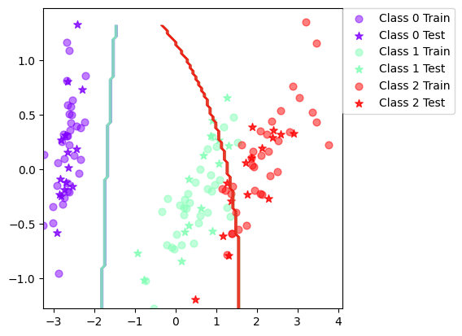
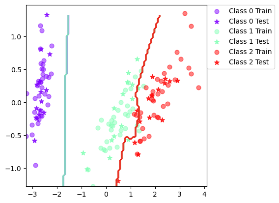
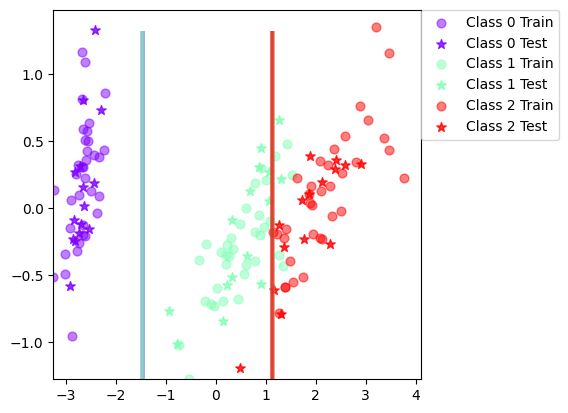
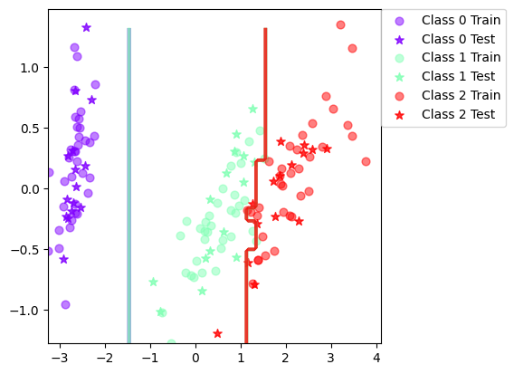

# Bayesian Classification and Boosting

## Description  
This project explores the implementation of a Naive Bayes classifier and its extension through boosting (AdaBoost) for supervised classification tasks. Performance is evaluated on standard datasets (Iris, Vowel, and Olivetti Faces), with comparisons to a decision tree classifier and its boosted version. The goal is to understand how different modeling assumptions and ensemble methods affect classifier performance.

## Key Results

| Dataset | Classifier              | Accuracy (%) | Std Dev |
|---------|--------------------------|--------------|---------|
| Iris    | Naive Bayes              | 89.0         | 4.16    |
| Iris    | Boosted Naive Bayes      | 94.7         | 2.82    |
| Iris    | Decision Tree            | 92.4         | 3.71    |
| Iris    | Boosted Decision Tree    | 94.6         | 3.65    |
| Vowel   | Naive Bayes              | 64.7         | 4.03    |
| Vowel   | Boosted Naive Bayes      | 80.2         | 3.52    |
| Vowel   | Decision Tree            | 64.1         | 4.00    |
| Vowel   | Boosted Decision Tree    | 86.6         | 2.85    |

Boosting significantly improved performance across datasets, particularly for the more complex vowel data.

## Visual Insights

<p align="center">
  
  
</p>
<p align="center">
  
  
</p>

*Decision boundaries on the Iris dataset using Naive Bayes and Decision Tree classifiers, with and without boosting.*

Boosting enabled the classifiers to model more expressive decision boundaries by combining multiple weak learners. This improved the model's ability to capture subtle patterns in the data, significantly reducing bias. While this added complexity can increase variance, the overall impact was a notable improvement in predictive performance—especially in cases where simpler models struggled to generalize effectively.


## Features

- Naive Bayes classifier using diagonal covariance matrices
- Boosted Naive Bayes with AdaBoost
- Decision Tree baseline using scikit-learn
- Boosted Decision Tree
- PCA-based dimensionality reduction
- Decision boundary visualizations

## Dataset

- Iris – 150 samples, 3 classes, 2D numeric features
- Vowel – 528 samples, 11 classes
- Olivetti Faces – 400 grayscale images (64x64), 40 classes

All datasets are loaded from the `data/` directory using a unified interface.

## File Structure

- `notebook.ipynb`: Contains the end-to-end workflow including classifier training, evaluation, visualization, and result reportin

- `utils.py`: Contains helper functions and reusable components for loading datasets, visualizing results, splitting data, performing PCA, and implementing classifiers (Naive Bayes, Decision Tree)

- `data/`: All three datasets that are being used in this project

## Methodology

- Parameters for the Naive Bayes model are estimated using maximum likelihood and maximum a posteriori methods.
- The AdaBoost algorithm is applied to both Naive Bayes and decision tree classifiers to form ensembles.
- Boosting adjusts the training sample weights iteratively to improve classification performance.
- PCA is used to reduce dimensionality for visualization and efficiency, especially on high-dimensional image data.

## Installation

```bash
pip install numpy scikit-learn matplotlib scipy
