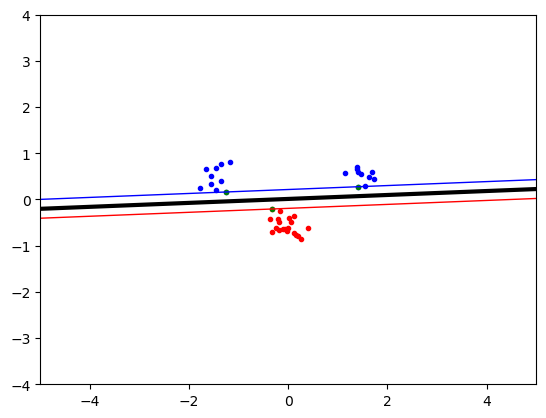
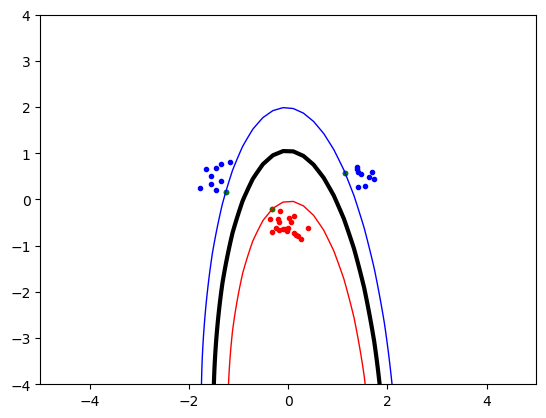
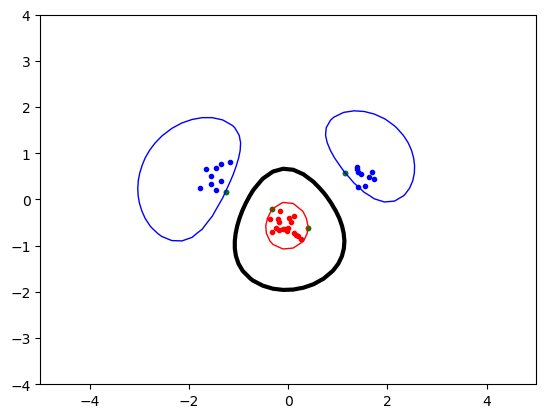

# Support Vector Machine Classifier

## Description

This project implements a Support Vector Machine (SVM) for binary classification from scratch using the dual formulation and kernel trick. It includes linear, polynomial, and RBF kernel support, along with visual analysis of decision boundaries and exploration of model hyperparameters.

## Key Results

| Kernel Type  | Key Parameter  | Effect on Decision Boundary            | Notes                                  |
|--------------|----------------|----------------------------------------|----------------------------------------|
| Linear       | —              | Straight line                          | Works well on linearly separable data  |
| Polynomial   | Degree $p$     | Curved boundary with increasing complexity | Higher $p$ increases model variance     |
| RBF          | Sigma $\sigma$      | Highly flexible curved boundary        | Lower $\sigma$ increases model variance     |
| All          | Slack $C$      | Controls margin width vs. misclassification | Higher $C$ reduces slack, fits tighter |

## Visual Insights

<p align="center">
  
  
  
</p>

*Visual comparison of decision boundaries, margins, and support vectors across different kernel types.*

The figures above highlight:
- How cluster position, spread, and separation may affect separability
- The adaptability of decision boundaries depending on the kernel used
- Observable examples of overfitting and underfitting across configurations

(See notebook for full visualizations.)

## Features

- Full SVM implementation using the dual optimization problem
- Support for linear, polynomial, and RBF kernels
- Manual control of margin softness via the regularization parameter $C$
- Custom indicator function for prediction
- Visualizations of decision boundaries, margins, and support vectors across datasets of varying complexity
- Exploration of overfitting and underfitting through kernel and parameter tuning

## Dataset

The project uses **synthetic 2D datasets** generated in the notebook using `numpy`. Key properties:
- Two-class, separable and non-separable cases
- Gaussian blobs with variable cluster separation and standard deviation
- Ideal for illustrating geometric intuition behind SVMs

No external datasets are used; all data is generated on the fly for clarity and control.

## File Structure

- `notebook.ipynb`  
  Contains the full experimental workflow, including:
  - Data generation and visualization
  - Custom SVM implementation using the dual formulation
  - Kernel functions (linear, polynomial, RBF)
  - Training and decision function
  - Performance analysis and decision boundary plots

There are no external Python modules; all code is self-contained within the notebook.

## Methodology

- SVMs trained using the dual optimization problem and solved with `scipy.optimize.minimize`
- Support for linear, polynomial, and RBF kernels
- Slack variables $C$ allow soft margins for non-linearly separable data
- Indicator function classifies points via the computed support vectors
- Decision boundaries and margins visualized using `matplotlib`


## Installation

To set up the environment, install the required packages using:

```bash
pip install numpy scipy matplotlib