# Poetry Generator: Comparative Analysis of Neural Architectures for Poetic Language Modeling


## Table of Contents
1. [Description](#description)  
2. [Key Results](#key-results)  
3. [Features](#features)  
4. [Dataset](#dataset)  
5. [Files Structure](#files-structure)  
6. [Methodology](#methodology)  
    1. [Preprocessing](#preprocessing)  
    2. [Training](#training)  
    3. [Evaluation](#evaluation)  
    4. [Generation](#generation)  
7. [Experiments](#experiments)  
	1. [Experimental Setup](#experimental-setup)  
    2. [Model Configurations](#model-configurations)  
8. [Results and Discussion](#results-and-discussion)  
    1. [Character-Level Tokenizer](#character-level-tokenizer)  
    2. [Byte-Pair Encoding Tokenizer](#byte-pair-encoding-tokenizer)  
    3. [Pretrained GPT-2](#pretrained-gpt-2)  
9. [Usage](#usage)  
    1. [Train a Model](#train-a-model)  
    2. [Evaluate Model Performance](#evaluate-model-performance)  
    3. [Generate Poems](#generate-poems)  
10. [Installation](#installation)


## Description
This project investigates **automatic poetry generation** through both **custom-built neural architectures** (RNN, LSTM, GPT) and **pretrained language models** (GPT-2). The models are trained on _Emily Dickinson’s_ _“Poems: Three Series, Complete”_ and evaluated using a combination of **linguistic**, **structural**, and **semantic** metrics to assess poetic quality and coherence.

The primary objective is to examine how variations in **architecture design** and **tokenization strategy** (character-level, BPE, and GPT-2) influence a model’s capacity to capture the **rhythm, style, and structure** characteristic of poetic language.

The final outcome is a fully automated pipeline for training, generating, and evaluating poetry under diverse configurations, providing a foundation for systematic experimentation in computational creativity.

## Key Results

<p align="center">
  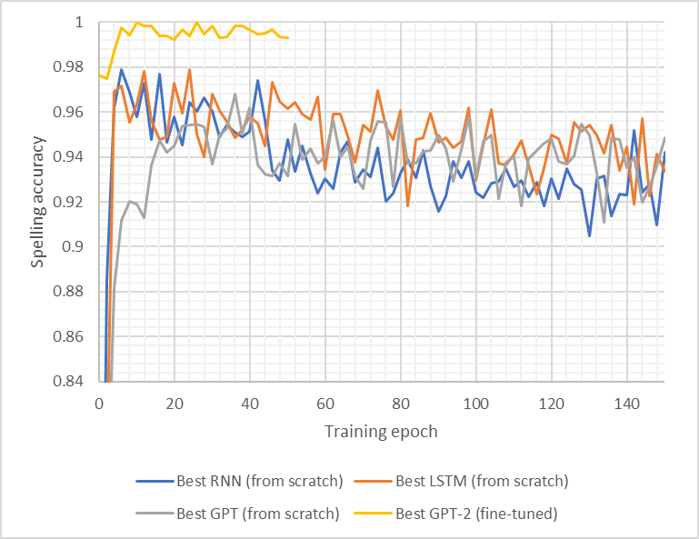
  
</p>
<p align="center">
  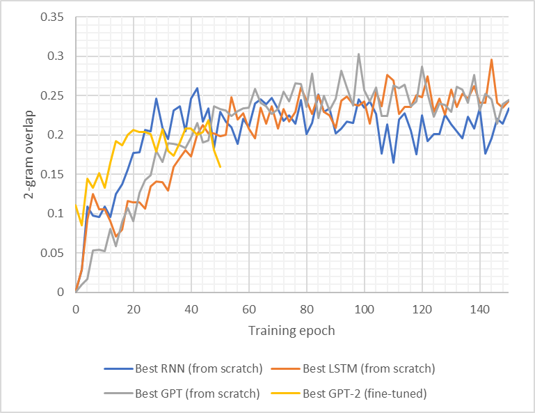
  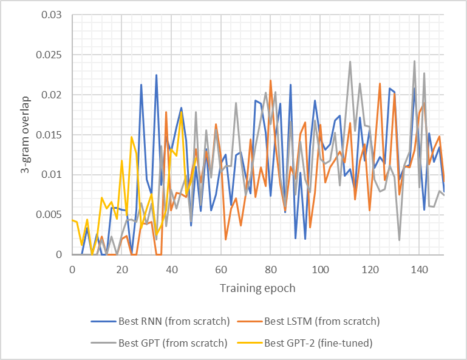
</p>
<p align="center">
  
  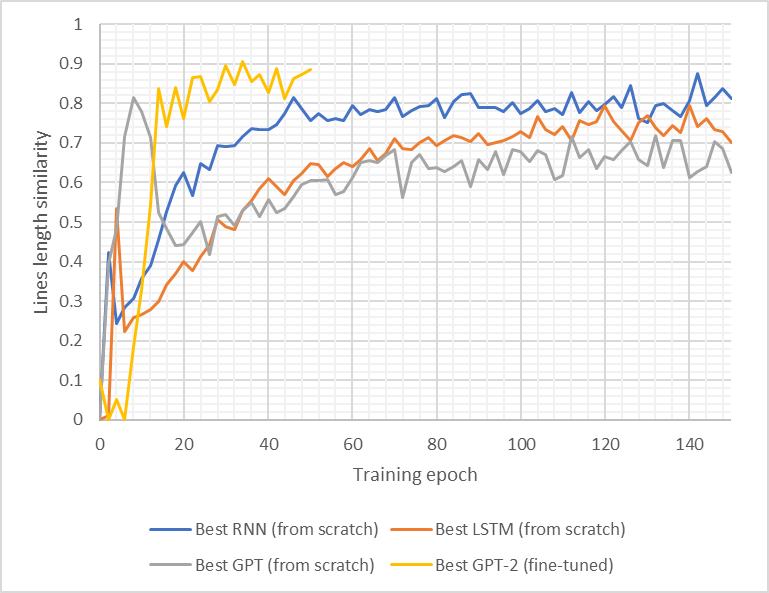
</p>

*Evolution of metrics during the training aff all best-performing model configurations.*


| Architecture     | Spelling acc. | Diversity score | 2-gram overlap | 3-gram overlap | ROUGE-L score | Blank line frac. sim. | Lines length sim. |
|----------------------------------|---------------|----------------|----------------|----------------|---------------|--------------------|-----------------|
| Best RNN (from scratch)     |  0.974    |    0.606       |     0.260  | 0.0159         |    **0.623**  |     0.543          |     0.748       |  
| Best LSTM (from scratch)  |  0.957    |    0.604       |     0.296  |    0.0113       |     **0.623**     |      0.541         |    0.762        |   
| Best GPT (from scratch)   |   0.958 |     **0.636**      |      **0.303** |     **0.0168**      | 0.620     |      0.584       |      0.68    |    
| Best GPT-2 (fine-tuned)   |       **0.996**      |       0.594       |     0.219         |    0.00757            |    0.577         |       **0.656**         |     **0.862**         |

*Metrics evaluation of the best-performing configurations for each model type, selected based on their combined score.*

```
THE SECRET.   

When the morning is gone, 
The night is gone. 

The morning's motions do nothing 
But leave their place. 
When the morning is taken, 

The night is taken. 
 

THE COLDEST.  

The coldest we have ever met 
Was this sweet night 
The last year 
She was only warm, but she —
For the first time in her life. 

The gentle waters
Forgot her lips; and yet there was a silence 
The rest was, 
Like the softnes.
```
*Illustrative output (from the fine-tuned HF GPT-2 configuration).*


## Features
- Trainable architectures: `RNN`, `LSTM`, `GPT`, and `GPT-2`
- Supports **LoRA fine-tuning** and **selective layer unfreezing** for GPT-2
- Multiple tokenizers: character-level, BPE, GPT-2 tokenizer
- Customizable training and evaluation configurations
- Poem generation with structural markers (`<TITLE>`, `<STANZA>`, `<POEM>`, etc.)
- Built-in evaluation framework for:
  - Spelling accuracy  
  - Lexical diversity  
  - n-gram overlap  
  - ROUGE-L score  
  - Poetic structure similarity  


## Dataset
The dataset consists of **Emily Dickinson’s poems** from *Project Gutenberg*: 'data/dickinson.txt'

Preprocessing includes:
- Normalization of whitespace and stanza spacing  
- Automatic tagging of titles, stanzas, and poem separators  
- Tokenization using the selected tokenizer (char/BPE/GPT-2)

## Files Structure

├── `main.py` — Main entry point for training and evaluation 
│  
├── `config.py` — Defines experiment settings and model hyperparameters  
│  
├── `core/` — Core code  
│ ├── `evaluate.py` — Implements evaluation metrics (spelling, diversity, n-gram overlap, ROUGE-L, structure)  
│ ├── `train.py` — Unified training loop for all models with evaluation and early stopping  
│ └── `generate.py` — Autoregressive text generation for all models (temperature scaling, top-k, top-p sampling)  
│  
├── `models/` — Models implementations
│ ├── `rnn.py` — Custom RNN model built with PyTorch  
│ ├── `lstm.py` — Custom LSTM model built with PyTorch  
│ ├── `gpt.py` — Custom GPT (decoder-only Transformer) built in PyTorch with Flash Attention acceleration
│ └── `gpt2.py` — GPT-2 wrapper (Hugging Face) with LoRA and layer freezing  
│  
├── `utils/` — Various utility functions
│ ├── `tokenizers.py` — Character-level, BPE, and GPT-2 tokenizer wrappers  
│ └── `helpers.py` — Helper functions for preprocessing, saving, and logging  
│  
├── `data/` 
│ └── `dickinson.txt` — Emily Dickinson’s “Poems: Three Series, Complete” (Project Gutenberg)  
│  
└── `training_results/` — Automatically saved training results
│  
└── `generated_text/` — Automatically saved generated poems

## **Methodology**
### 1. **Preprocessing**
   - Clean and annotate raw text using structural tokens
   - Tokenize with chosen tokenizer (`char`, `bpe`, or `gpt2`)
   - Split the text into overlapping chunks for GPT models, using a 78% overlap.

### 2. **Training**
   - Autoregressive next-token prediction
   - **Cross-entropy loss** with optional **label smoothing** 
   - **Early stopping** based on a composite evaluation metric  
   - Regularization through configurable **weight decay** and **dropout**
   - **Cosine annealing scheduler** and **AdamW optimizer**
   - Validation loss and stylistic metrics tracked per epoch

### 3. **Evaluation**
   - Compute reference-free and reference-based metrics:
     - **Spelling accuracy**, **lexical diversity**
     - **n-gram overlap**, **ROUGE-L**
     - **Blank-line fraction** and **mean line length** similarity
   - Combined score integrates multiple stylistic metrics

### 4. **Generation**
   - Start from `<POEM>` prefix
   - Use **temperature scaling**, **top-k**, and **top-p (nucleus)** sampling
   - Decode tokens and reformat poems with line breaks and stanza spacing

## Experiments

### 1. Experimental Setup
#### - Training

The training loop employed the **AdamW optimizer** with **selective weight decay** ranging from _1e-4_ to _1e-2_, applied exclusively to weight parameters to prevent over-regularization of biases and normalization terms. A **Cosine Annealing Learning Rate scheduler** was used to promote smoother convergence toward the later stages of training, with initial learning rates varying between _1e-5_ and _1e-3_ depending on the configuration.

A **dropout rate of 0.2** was consistently applied for regularization across all models, except during fine-tuning, where a lower rate was only applied on LoRA parameters. Models trained **from scratch** were run for **150 epochs**, while **fine-tuning** was limited to **50 epochs** due to computational resource constraints.

A **batch size of 32** was used for all training-from-scratch experiments, whereas **fine-tuning** employed a smaller batch size of **4** to fit GPU memory limits. The **context window** was set to **512 tokens** for character-level tokenizers and **256 tokens** for subword-level tokenizers, balancing computational efficiency and contextual coverage.

#### - Generation
All generated texts were produced using a combination of **temperature scaling**, **top-k sampling**, and **top-p (nucleus) sampling** to balance creativity and coherence. Generation parameters were set to _temperature = 0.9_, _top_k = 20_ for **character-level tokenizers**, and _top_k = 110_ for **subword-level tokenizers**, with _top_p = 0.9_ applied in both cases.

For the **fine-tuned GPT-2 model**, an additional constraint of _no_repeat_ngram_size = 5_ was used to minimize redundant phrasing and encourage lexical diversity in the generated poems.

All **evaluation metrics** were computed consistently across experiments and averaged over **10 independently generated samples** per configuration to ensure statistical reliability and reduce the influence of random variation.


#### - Evaluation

Model performance was assessed using a combination of **reference-free** and **reference-based** evaluation metrics designed to capture the linguistic, structural, and semantic quality of the generated poems.

- **Reference-free metrics:**  
  - **Spelling Accuracy:** Measures the fraction of correctly spelled words in the generated text using an English dictionary checker.  
  - **Diversity Score:** Computes the ratio of unique correctly spelled words to total words, reflecting the model’s vocabulary richness and variation.

- **Reference-based metrics:**  
  These metrics compare the generated outputs to both the **training** and **validation** datasets to estimate stylistic and structural similarity to the source material.  
  - **N-gram Overlap (2-gram, 3-gram):** Evaluates local lexical similarity by computing the fraction of shared n-grams between reference and generated texts.  
  - **ROUGE-L Score:** Measures the longest common subsequence overlap between generated and reference texts, providing an approximation of semantic and syntactic coherence.  
  - **Structural Consistency:** Assesses stylistic resemblance based on stanza organization and line length. Two sub-metrics are computed:  
    - *Blank-line Fraction Score*: captures the ratio of blank lines (i.e., stanza breaks) relative to the reference poems.  
    - *Mean Line Length Similarity*: evaluates how closely the average line length matches that of the reference corpus.

All metrics were computed for **10 independently generated samples** per configuration, and their results were **averaged** to reduce stochastic effects and ensure robust evaluation.  

### 2. Model Configurations

#### - RNN from scratch

The following four RNN model configurations were implemented and trained from scratch on the dataset:

| **Model** | **Embedding Dimension** | **Hidden Dimension** | **Number of Layers** |
|:-----------|:------------------:|:--------------------:|:--------------------:|
| RNN 64-128-1 | 64 | 128 | 1 |
| RNN 64-128-3 | 64 | 128 | 3 |
| RNN 128-216-1 | 128 | 216 | 1 |
| RNN 128-216-3 | 128 | 216 | 3 |

Each configuration was trained and evaluated using both character-level and BPE (Byte Pair Encoding) tokenization schemes.


#### - LSTM from scratch
The following four LSTM model configurations were implemented and trained from scratch on the dataset:

| **Model** | **Embedding Dimension** | **Hidden Dimension** | **Number of Layers** |
|:-----------|:------------------:|:--------------------:|:--------------------:|
| LSTM 64-128-1 | 64 | 128 | 1 |
| LSTM 64-128-3 | 64 | 128 | 3 |
| LSTM 128-216-1 | 128 | 216 | 1 |
| LSTM 128-216-3 | 128 | 216 | 3 |

Each configuration was trained and evaluated using both character-level and BPE (Byte Pair Encoding) tokenization schemes.

#### - GPT from scratch
The following two GPT model configurations were implemented and trained from scratch on the dataset:

| **Model** | **Embedding Dimension** | **Number of Attention Heads** | **Number of Layers** |
|:-----------|:------------------:|:--------------------:|:--------------------:|
| GPT 128-2 | 128 | 2 | 2 |
| LSTM 216-4 | 216 | 4 | 4 |

Each configuration was trained and evaluated using both character-level and BPE (Byte Pair Encoding) tokenization schemes.

#### - HF GPT-2 fine-tuning
The fine-tuning process involved unfreezing the last two transformer blocks, as well as the embedding layer, to allow the model to adjust its internal representations and learn appropriate embeddings for the newly added special tokens. Additionally, **LoRA** (Low-Rank Adaptation) was applied for parameter-efficient fine-tuning, using the following configuration: rank = 8, α = 32, dropout = 0.05, and targeting the GPT-2 modules _c_attn_, _c_fc_, and _c_proj. This setup enabled effective adaptation for causal language modeling while maintaining most of the pre-trained weights frozen.

> **Note:** All detailed hyperparameters and settings can be found in the `config.py` file.


## Results and Discussion

###  1. Character-Level Tokenizer

#### - RNN from scratch

<p align="center">
  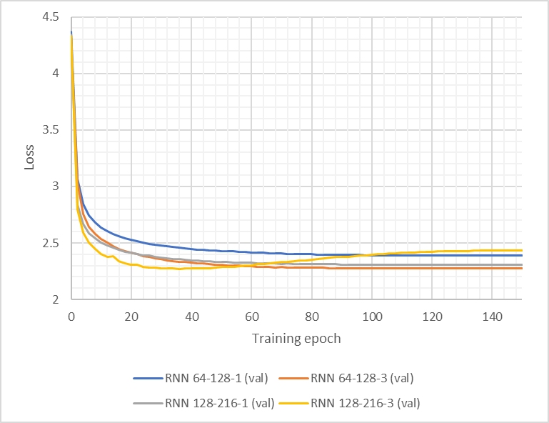
  
  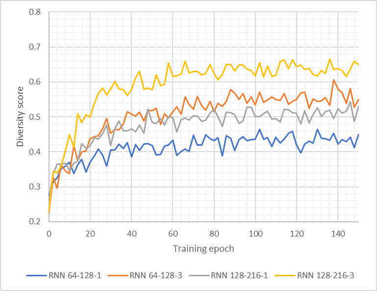
</p>

<p align="center">
  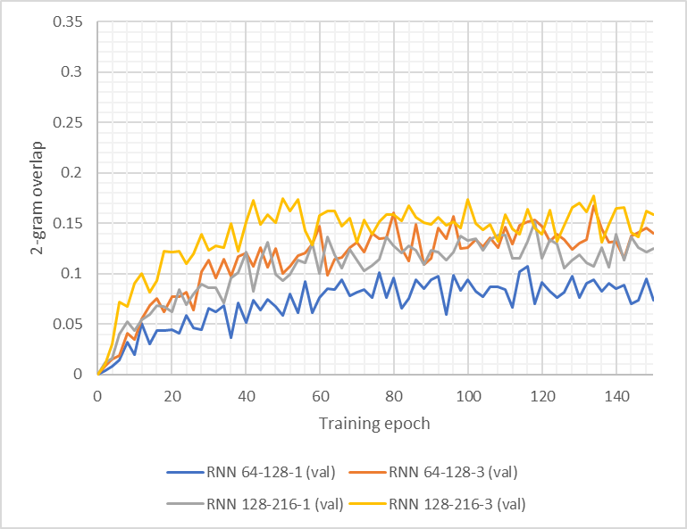
  
  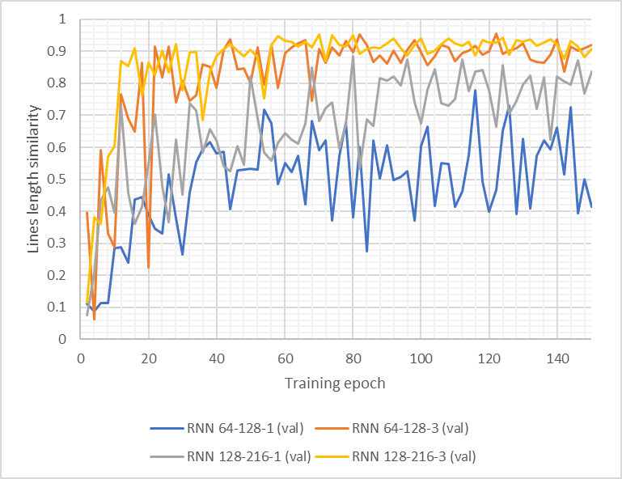
</p>

*Evolution of loss and metrics during training for multiple RNN architectures using character-level tokenizer.*


| Architecture     | Spelling acc. | Diversity score | 2-gram overlap | 3-gram overlap | ROUGE-L score | Blank line frac. sim. | Lines length sim. |
|----------------------------------|---------------|----------------|----------------|----------------|---------------|--------------------|-----------------|
| RNN 64-128-1              |  0.742        |      0.454     |      0.107     |     0.00288    |      0.527    |       **0.639**    |      0.779      |   
| RNN 64-128-3              |  0.836        |     0.555      |    0.167       |       0.00296  |    **0.540**  |    0.455           |  0.866          |     
| RNN 128-216-1            |    0.811      |   0.512        |     0.152      |   0.00292      |    0.535      |     0.629          |     0.840       |    
| RNN 128-216-3            | **0.899**     |   **0.625**    |    **0.177**   |   **0.00742**  |    0.531      |      0.433         |    **0.912**    |   

*Metrics evaluation of the best-performing models for each RNN architecture, selected based on their combined score.*

```
MERTES. 

Becond the amber speature shadown
The street through the solike to me
The called the bee the grace, —
The matiation for the seamed
And make before the gain
It was noon banks for spring will of its look.

And seth it be a bird,
But dropped everywhere,
But the see itself as sweet
As who at define
With hurried the east,
The breaking flowers down
By he some behind our weet.
He pearl the sun gets as such a days;
And then her begatation or the fires
Who foreign should be sun,
So scrowned, from the world!

No old from should stepped
The gales lost to me, —
A corciet in the gown
That was human fingers be,
Enight descends of corred
And glead the sentloked the binds and stark in the selence
```
*Illustrative output from the top-performing RNN configuration (128–216–3) using character-level tokenizer.*

The RNN model consistently benefits from larger architectures across all evaluated metrics, with notable improvements in diversity score, spelling accuracy, and 2-gram overlap. Line length similarity also improves with network depth, particularly in the 3-layer configurations, which exhibit a structure more closely aligned with the validation reference. The largest model shows slight indications of overfitting when examining the validation loss; however, this does not yet appear to negatively impact the evaluation metrics. Overall, these results suggest that increasing model capacity enhances linguistic and structural performance up to a certain point, beyond which the benefits may start to plateau or risk overfitting.


#### - LSTM from scratch

<p align="center">
  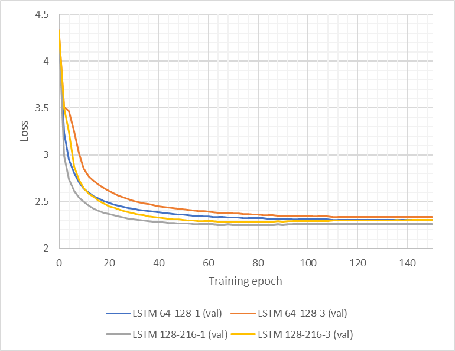
  
  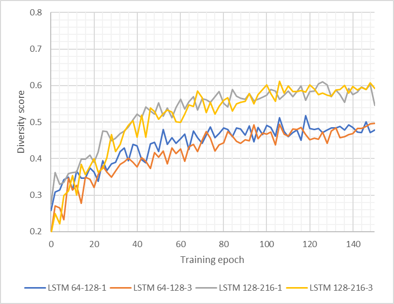
</p>

<p align="center">
  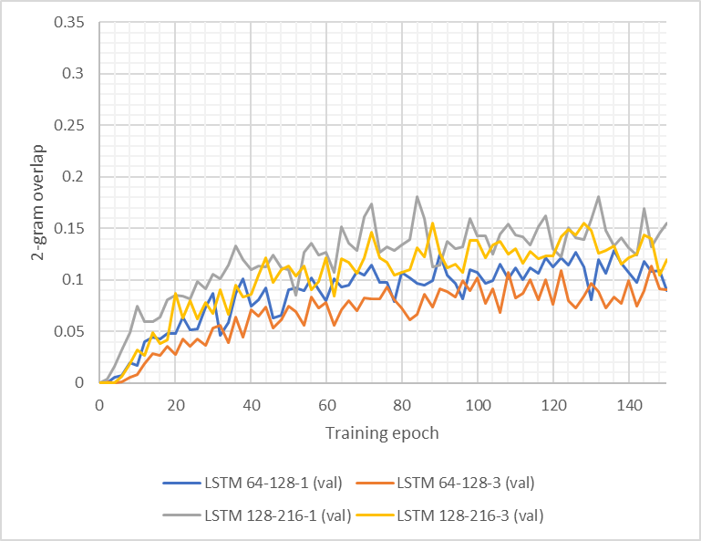
  
  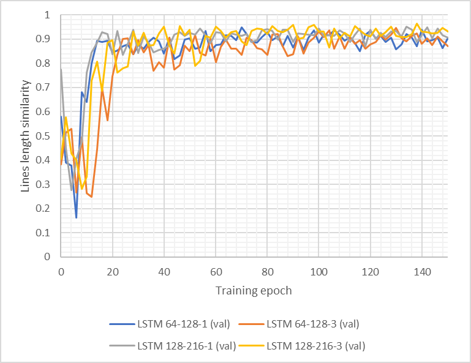
</p>

*Evolution of loss and metrics during training for multiple LSTM architectures using character-level tokenizer.*


| Architecture     | Spelling acc. | Diversity score | 2-gram overlap | 3-gram overlap | ROUGE-L score | Blank line frac. sim. | Lines length sim. |
|-----------------|---------------|----------------|----------------|----------------|---------------|--------------------|-----------------|
| LSTM 64-128-1   |    0.807      |    0.518       |    0.122       |  0.00137       |     0.538     |       0.552        |   0.919         |
| LSTM 64-128-3    |   0.770       |     0.488      |    0.114       |    0.00433     |     0.508     |      0.463         |    0.310        |
| LSTM 128-216-1   |   **0.865**   |  **0.590**     |      **0.181** |    0.0103      |    **0.545**  |    0.337           |     0.900       |
| LSTM 128-216-3   |    0.846      |    0.574       |     0.155      |    **0.0104**  |    0.533      |     **0.629**      |      **0.950**  |

*Metrics evaluation of the best-performing models for each LSTM architecture, selected based on their combined score.*

```
PERARBER. 

When had play is all the clover.
Measich the crowd it as for me.
A scince a consciousness chartur,
Of white her came was sirige.

A first could never down a star?
Some shooth is was some for me
That solebled the bore a flower,
Ment it himmer finters out
The breek, or touch the sunrre.
```
*Illustrative output from the top-performing LSTM configuration (128–216–1) using character-level tokenizer.*


Similarly, the LSTM model demonstrates performance improvements with increasing model size across all metrics. However, these gains are somewhat smaller than those observed for the RNN, suggesting that the inherent complexity of the LSTM architecture enables more consistent performance across different configurations. The most substantial improvements arise from increasing the embedding and hidden dimensions, particularly in terms of spelling accuracy, diversity score, and 2-gram overlap, indicating that richer internal representations allow the model to better capture linguistic structure and variation.

#### - GPT from scratch

<p align="center">
  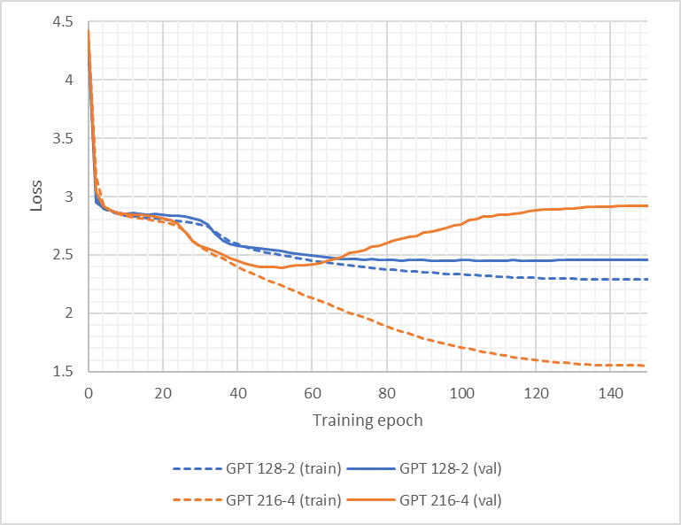
  
  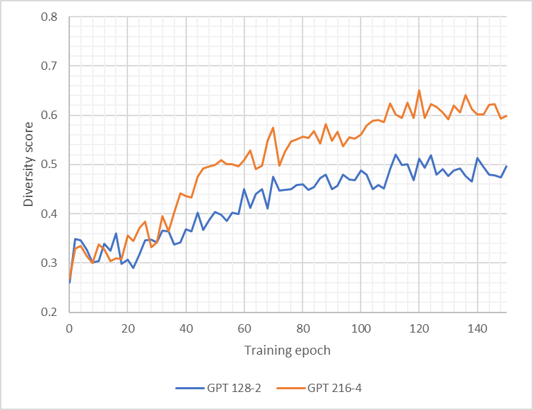
</p>

<p align="center">
  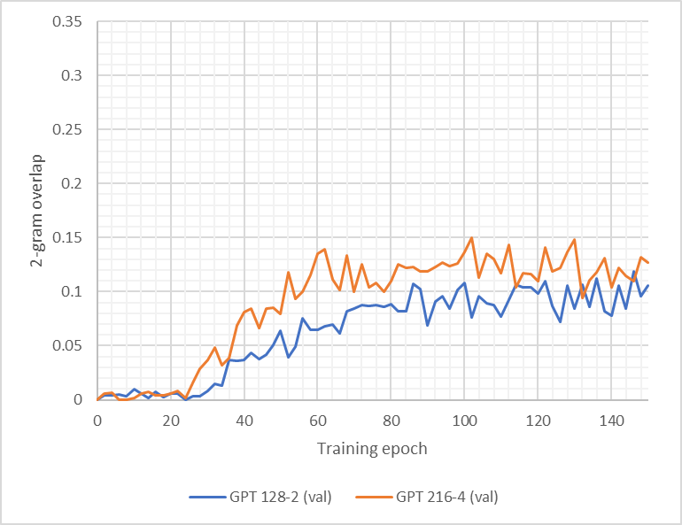
  
  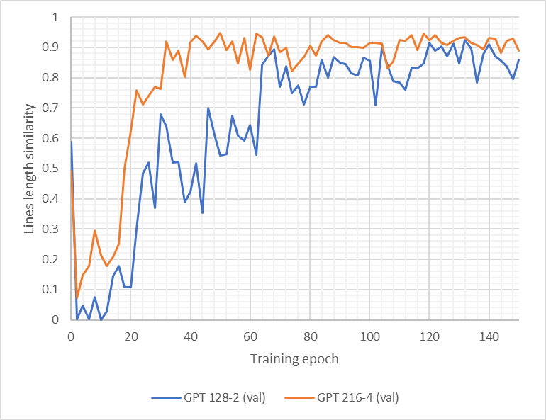
</p>

*Evolution of loss and metrics during training for multiple GPT architectures using character-level tokenizer.*


| Architecture    | Spelling acc. | Diversity score | 2-gram overlap | 3-gram overlap | ROUGE-L score | Blank line frac. sim. | Lines length sim. |
|-----------------|---------------|----------------|----------------|----------------|---------------|--------------------|-----------------|
| GPT 128-2     |     0.817    |     0.478      |      0.119     |     **0.00417**      | **0.574**           |      **0.702**           |      0.68    |  
| GPT 216-4    |    **0.838**      |      **0.579**     |      **0.150**     |     0.0           |    0.541      |    0.567             |   **0.915**              |


*Metrics evaluation of the best-performing models for each GPT architecture, selected based on their combined score.*

```
ETAYER. 

My can beging oner be,
It cannot to conductes untons
And of pensives.

His fellude cher sendial do not the subterfuguest
Befoging, and should beath.
Guessed a lone belowed me,
Our flag not be the dust.
Not that such a put of content,
Except the bee,
And cipher the malled frosty as the report,
And the help the bonnet.

And were the hose grace the fingers by take to the time,
And whose when by to snakes delind to be.
Little brow, —
The ask many to the dew
As if the part the may beggands;
```
*Illustrative output from the top-performing GPT configuration (216–4) using character-level tokenizer.*

Once again, the largest GPT model achieves the best performance across nearly all metrics. However, the loss curves indicate clear signs of overfitting beginning around epoch 50. Despite this, most evaluation metrics continue to improve, with the exception of the ROUGE-L score, which shows a slight decline, suggesting that while the model continues to learn finer-grained patterns, its ability to maintain coherent or globally consistent structures may start to degrade.

### 2. Byte-Pair Encoding Tokenizer

#### - RNN from scratch

<p align="center">
  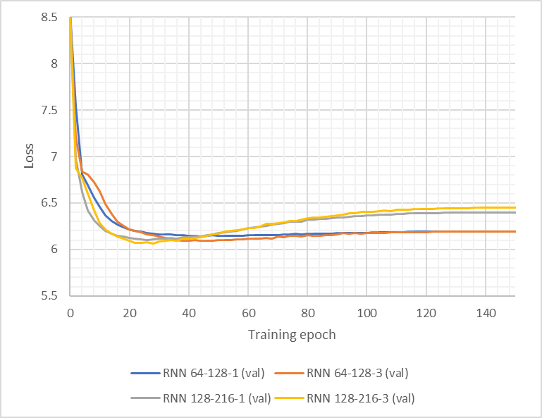
  
  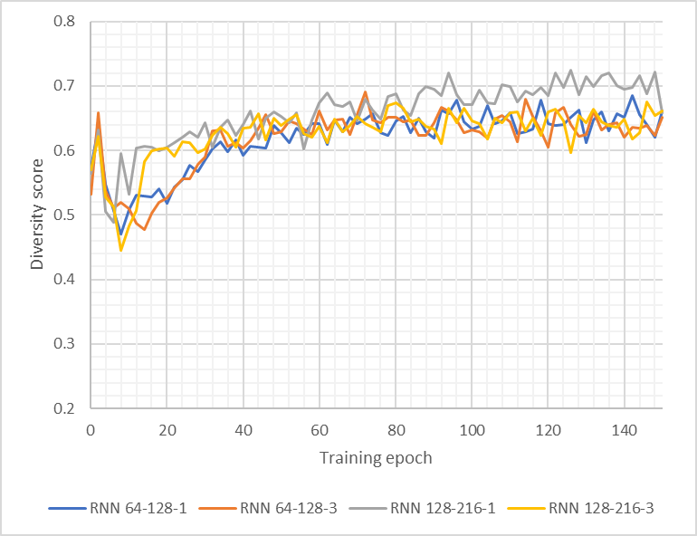
</p>

<p align="center">
  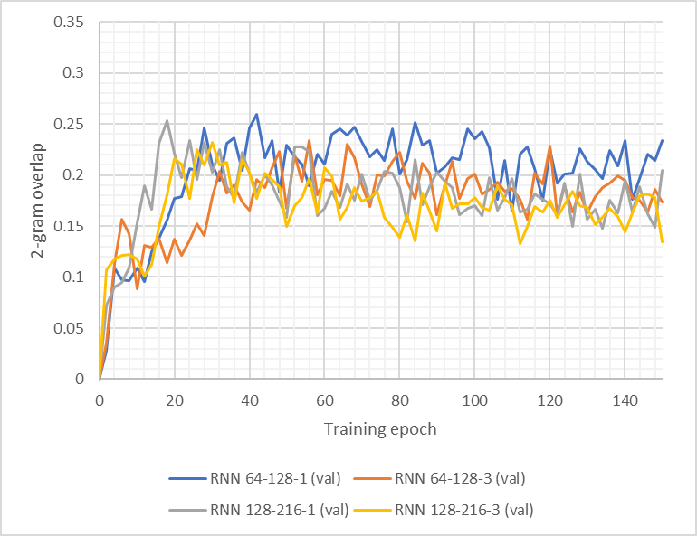
  
  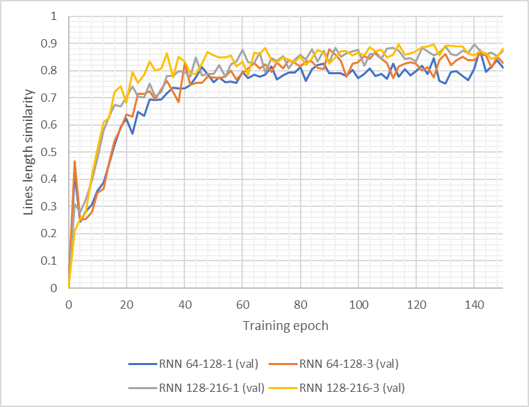
</p>

*Evolution of loss and metrics during training for multiple RNN architectures using BPE tokenizer.*

| Architecture    | Spelling acc. | Diversity score | 2-gram overlap | 3-gram overlap | ROUGE-L score | Blank line frac. sim. | Lines length sim. |
|----------------------------------|---------------|----------------|----------------|----------------|---------------|--------------------|-----------------|
| RNN 64-128-1                |  **0.974**    |    0.606       |     **0.260**  | 0.0159         |    **0.623**  |     0.543          |     0.748       |   
| RNN 64-128-3               |    0.933      |     **0.648**  |    0.230       |      0.00934   |   0.574       |    0.608           |   **0.808**     |    
| RNN 128-216-1               |     0.969     |   0.600        |    0.253       |  0.0188        |   0.617       |     **0.691**      |     0.669       |   
| RNN 128-216-3               |     0.943     |    0.603       |     0.232      |     **0.0214** |     0.604     |      0.480         |     0.799       |   


*Metrics evaluation of the best-performing models for each RNN architecture, selected based on their combined score.*

```
THE BAT. 

That wents had a night
To know a purple,
How many within the sun,
The seasons in the dawn
But is the vision trees
For such the sun's skies.

To it it was me.
But the perfect would,
His idleness the sky,
The mail wents the days;
That lit in the village,
Fs, and the skies.

SoT is many in the
Where an, and stare,
And then theired in the breast;
So only the days c,
And noon and the sun,
And a little yellow that,
But the dewic's life,
D feet of the bee,
My is overed.
```
*Illustrative output from the top-performing RNN configuration (64–128–1) using BPE tokenizer.*

The RNN model using a BPE tokenizer shows a clear performance improvement over the character-level version across all metrics, except for line length similarity. This improvement likely stems from the tokenizer’s ability to capture subword-level patterns, allowing the model to better represent frequent morphemes and word fragments while reducing sequence length. However, this gain comes at the cost of increased overfitting, as evidenced by an early decline in the 2-gram overlap and ROUGE-L metrics, particularly for architectures with larger embedding and hidden dimensions. This behavior suggests that while the model benefits from richer representations, it may also start to memorize training sequences more readily. Overall, the metrics remain relatively stable across architectures, with the simplest configuration even outperforming others on several key measures. This suggests that beyond a certain capacity, the benefits of larger models saturate under this tokenization scheme.

#### - LSTM from scratch

<p align="center">
  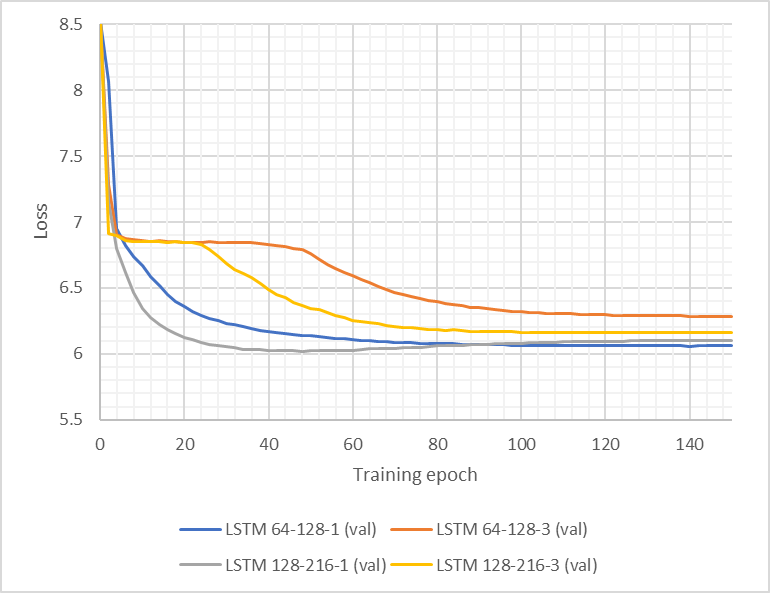
  
  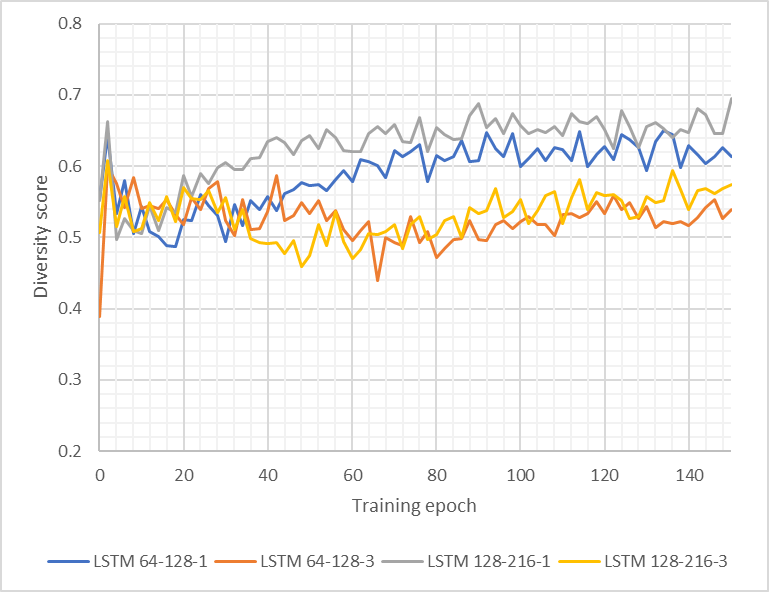
</p>

<p align="center">
  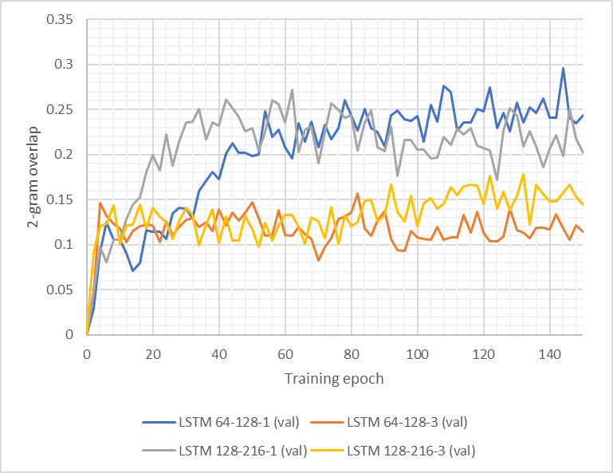
  
  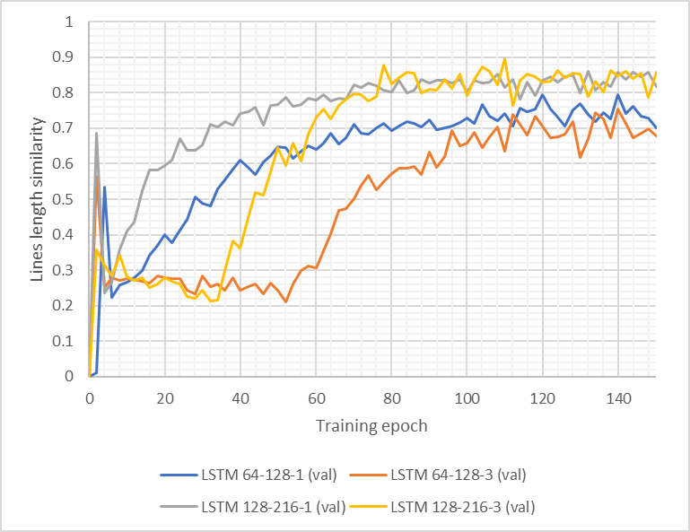
</p>

*Evolution of loss and metrics during training for multiple LSTM architectures using BPE tokenizer.*

| Architecture     | Spelling acc. | Diversity score | 2-gram overlap | 3-gram overlap | ROUGE-L score | Blank line frac. sim. | Lines length sim. |
|-----------------|---------------|----------------|----------------|----------------|---------------|--------------------|-----------------|
| LSTM 64-128-1   |  **0.957**    |    0.604       |     **0.296**  |    0.0113       |     0.623     |      0.541         |    0.762        |
| LSTM 64-128-3    |     0.953     |   0.526        |     0.140      |     0.0         |   **0.632**   |     0.597          |    0.719        |
| LSTM 128-216-1   |    0.947      |    **0.621**   |     0.272      |    **0.0129**   |   0.603       |     **0.687**      |   0.795         |
| LSTM 128-216-3  |   0.922       |    0.560       |     0.177      |   0.00164       |   0.619       |      0.451         |     **0.834**   |

*Metrics evaluation of the best-performing models for each LSTM architecture, selected based on their combined score.*

```
SUNSETST FLOWERSSRY. 

The parties a little would!
It is the sea,
Of that for the land,

No one is the soul
By it would to my!
That to be at,
And then, the road,
The hills out of my summer like a night.

As if from the bird
Tos have at the dew
To never their not soar
That law such all the host.

But when the skies of snow,
And a throe, -

The interd we are of the sun
The sun an of summer.
```
*Illustrative output from the top-performing LSTM configuration (64–128–1) using BPE tokenizer.*

Once again, the BPE tokenizer leads to overall performance improvements. However, the LSTM model exhibits an unexpected behavior during the training of the 3-layer architectures, with the loss plateauing during the early stages before starting to decrease again after approximately 25 to 40 epochs. This phenomenon could be attributed to optimization difficulties in deeper recurrent networks, such as vanishing gradients or slower convergence due to the increased number of parameters. It may also suggest that the model initially struggles to balance the complex internal dynamics introduced by additional layers before eventually stabilizing and learning more effectively. Although this slow start is compensated for later, the single-layer architectures still show slightly better overall results, possibly due to their simpler structure and more stable training dynamics.

#### - GPT from scratch

<p align="center">
  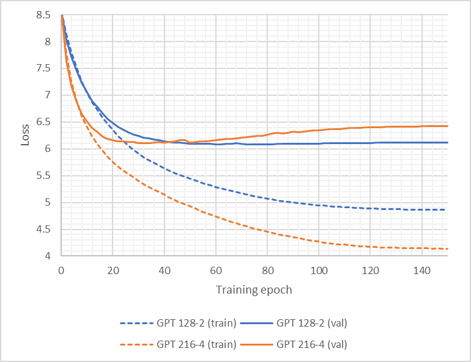
  
  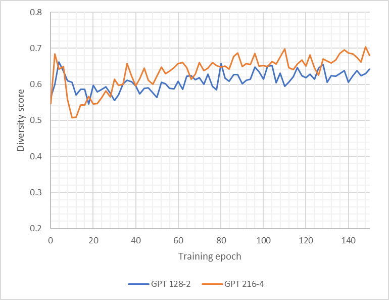
</p>

<p align="center">
  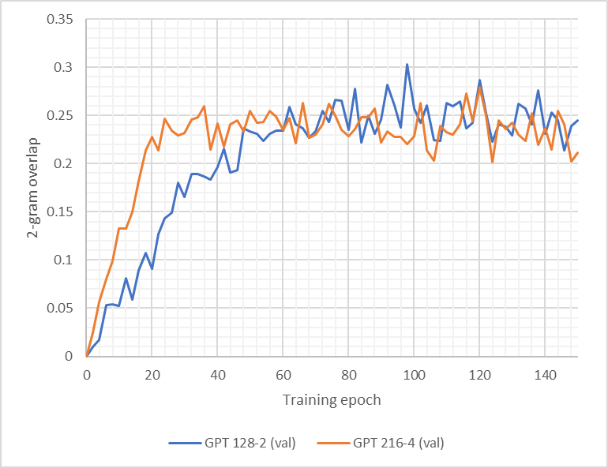
  
  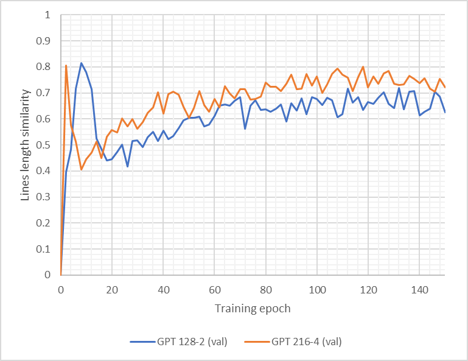
</p>

*Evolution of loss and metrics during training for multiple GPT architectures using BPE tokenizer.*

| Architecture   | Spelling acc. | Diversity score | 2-gram overlap | 3-gram overlap | ROUGE-L score | Blank line frac. sim. | Lines length sim. |
|-----------------|---------------|----------------|----------------|----------------|---------------|--------------------|-----------------|
| GPT 128-2    |     **0.958**|     0.636      |      **0.303** |     0.0168      | **0.620**     |      **0.584**       |      0.68    |  
| GPT 216-4   |    0.938      |  **0.650**     |      0.279     |     **0.0225**  |    0.593      |    0.553             |  **0.721**   |

*Metrics evaluation of the best-performing models for each GPT architecture, selected based on their combined score.*

```
THE DAY. 

You finished, -
A few,
Where mies him -
And then that he passed the sky, and my life was there, and vital-day
If it would be.

With a faints to-morrow,
In an hour to me, -
What were too,
Be itsHEDQUES.

And were a single face, who was a chor of the dead
And then 'T is said,
It was warming's last
The hills,
And yet,
A few, like a single feet
And an hour to me.
```
*Illustrative output from the top-performing GPT configuration (128–2) using BPE tokenizer.*

The GPT model using a BPE tokenizer also shows a consistent performance boost compared to its character-level counterpart. As observed in previous experiments, the largest model exhibits slight signs of overfitting around epoch 30, although the effect on the evaluation metrics remains negligible. Interestingly, like in other BPE-tokenized setups, the largest architecture no longer clearly outperforms the smaller ones, with all configurations achieving very similar results. This convergence suggests that beyond a certain capacity, increasing model size yields diminishing returns, possibly because the BPE tokenization already provides sufficient expressive power for the model to capture most relevant linguistic patterns.

### 3. Pretrained GPT-2

<p align="center">
  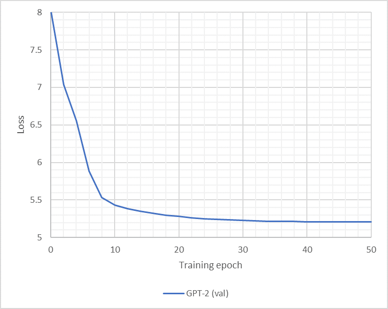
  
  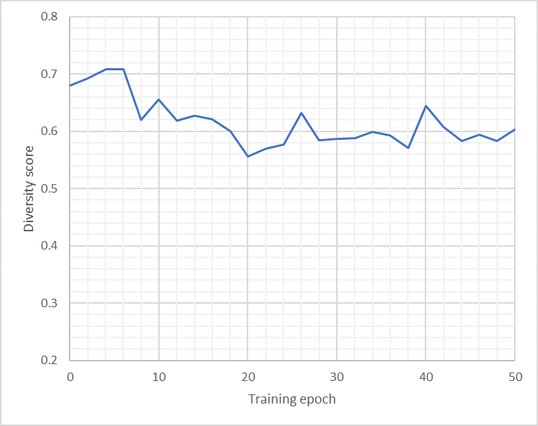
</p>

<p align="center">
  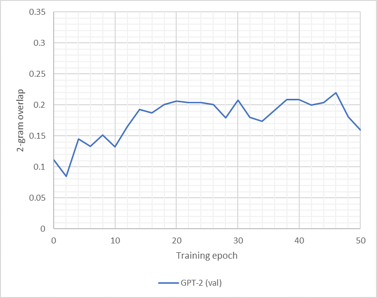
  
  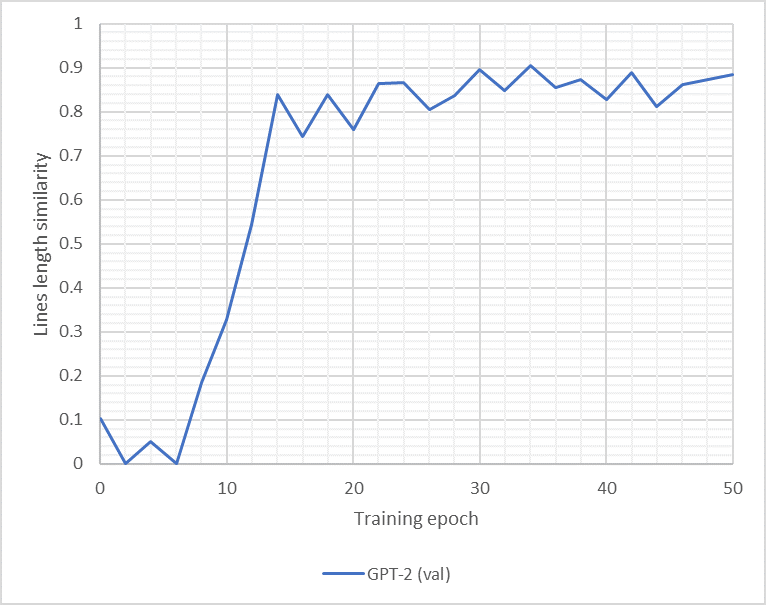
</p>

*Evolution of loss and metrics during the fine-tuning of HF GPT-2 using GPT-2 tokenizer.*

| Architecture    | Spelling acc. | Diversity score | 2-gram overlap | 3-gram overlap | ROUGE-L score | Blank line frac. sim. | Lines length sim. |
|-----------------|---------------|----------------|----------------|----------------|---------------|--------------------|-----------------|
| Fine-tuned GPT-2   |       0.996      |       0.594       |     0.219         |    0.00757            |    0.577         |       0.656         |     0.862         |

*Metrics evaluation of the best-performing model for the fine-tuned HF GPT-2 architecture, selected based on its combined score.*

```
THE SECRET.   

When the morning is gone, 
The night is gone. 

The morning's motions do nothing 
But leave their place. 
When the morning is taken, 

The night is taken. 
 

THE COLDEST.  

The coldest we have ever met 
Was this sweet night 
The last year 
She was only warm, but she —
For the first time in her life. 

The gentle waters
Forgot her lips; and yet there was a silence 
The rest was, 
Like the softnes. 
  
 
THE WIND WOULD NOT FLY

The wind was long, long, long, 

But the wind would not fly, 
The wind would never give me back. 

The wind would not break the sky 
The wind would not leave my soul, 
The wind, if not be able, 

Cannot stop me, 
The wind cannot break my soul.


THE THIRD SEASON.  

The land is as it is, 
The moon as it is, 
The stars as it is, 

But the air of the sea 
Is the heaven. 
And when the sea is gone, 
When the sky is gone,
```
*Illustrative output from the fine-tuned HF GPT-2 configuration using GPT-2 tokenizer.*

The model leverages its prior knowledge of English to produce grammatically correct sentences from the very beginning, resulting in high spelling accuracy and strong lexical diversity early in training. The most notable improvements occur in structural coherence, particularly in the consistency of line lengths. Initially, the model tends to generate long paragraphs, but it progressively learns to compose shorter, more rhythmically balanced sentences arranged in stanzas that better reflect a poetic style. Although its evaluation metrics are similar to those of other models, its outputs display superior logical structure and a greater overall sense of coherence.

## Usage

### 1. Train a Model
Configure the experiment parameters in `config.py`:

```python
# Example configuration
model_config = {
		'type': 'GPT', # Options: "RNN", "LSTM", "GPT", "GPT2"
		'd_model': 216,
		'n_heads':4,
		'n_layers': 4,
		'weight_decay': 1e-4,
		'dropout': 0.2,
		'bias': False
}

training_config = {
		'model': model_config,
		'lr': 1e-3,
		'n_epochs': 100,
		'batch_size': 32,
		'batch_size_eval': 1,
		'block_size': 256,
		'print_every': 1,
		'eval_every': 2,
		'n_generate': 90,
		'tok_type': 'bpe' # Options: "char", "bpe", "gpt2"
}
```
Then run `main.py`, which will:

-   Train the model on Dickinson’s poems

-   Evaluate it periodically
    
-   Log all metrics
    
-   Save the best-performing checkpoint and generated samples

### 2. Evaluate Model Performance

After each evaluation, metrics are automatically saved in: `training_results/<model_name>/metrics.csv` 

Each row includes:

-   Training and validation loss
    
-   Spelling and diversity metrics
    
-   ROUGE-L and n-gram overlap
    
-   Structural similarity metrics
    
-   A combined overall performance score (used for early stopping)

### 3. Generate poems
Once a model is trained and saved, it is possible to generate new poems interactively.


Outputs are saved to:

`generated_text/` 


## **Installation**

`pip install -r requirements.txt` 
