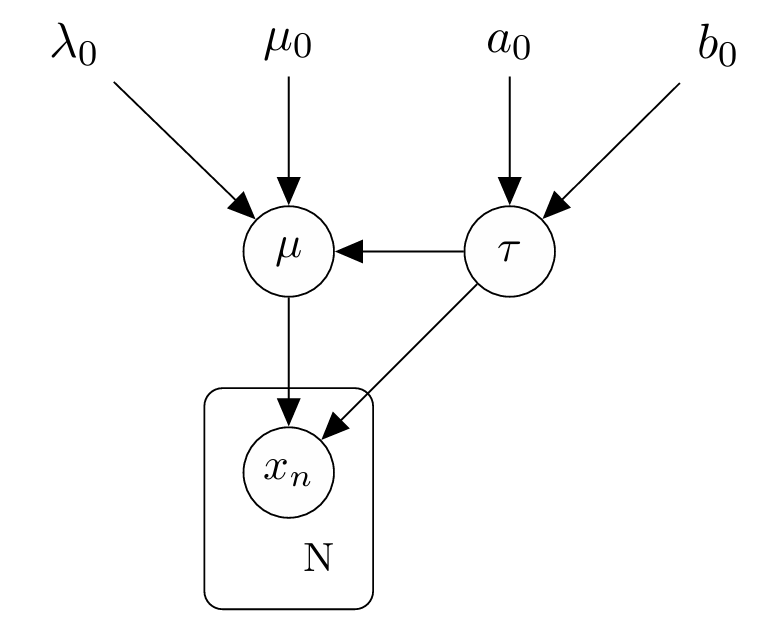
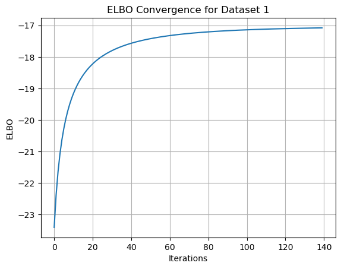
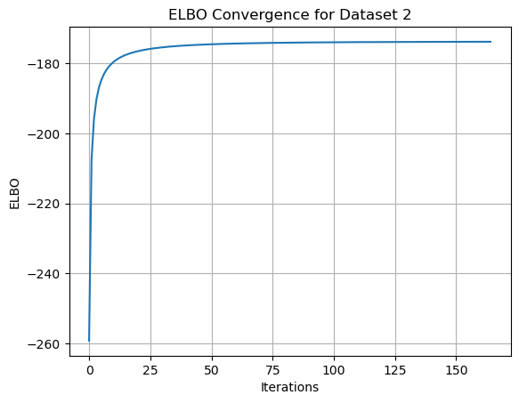
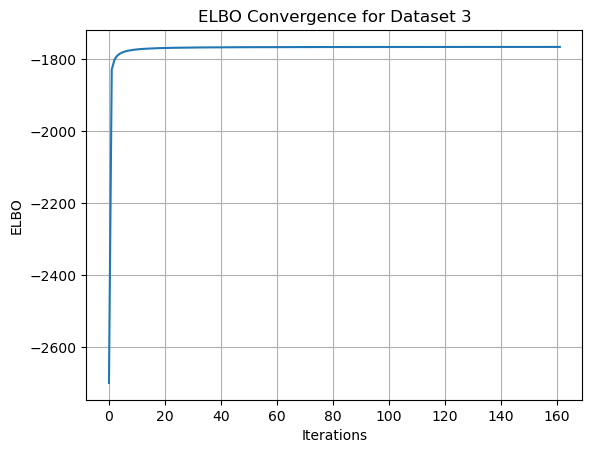
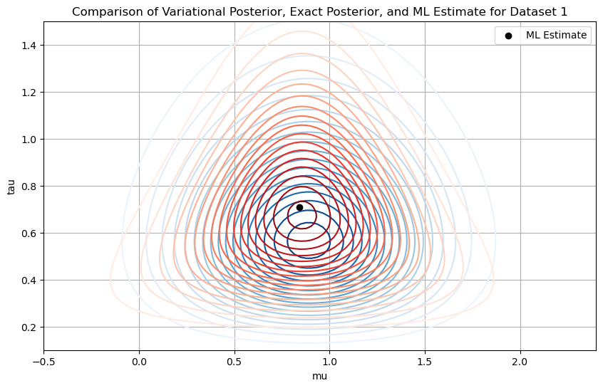
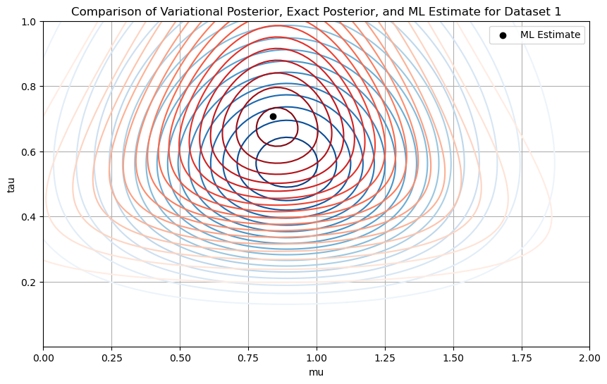
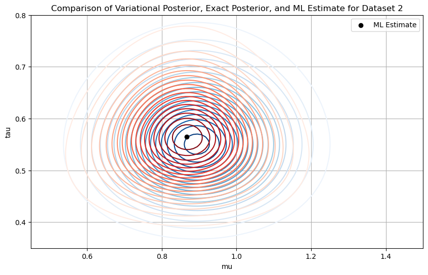
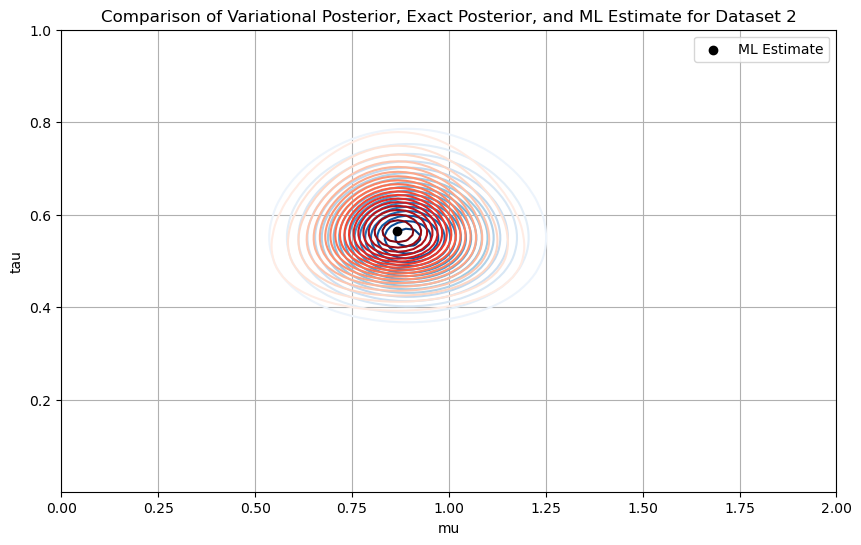
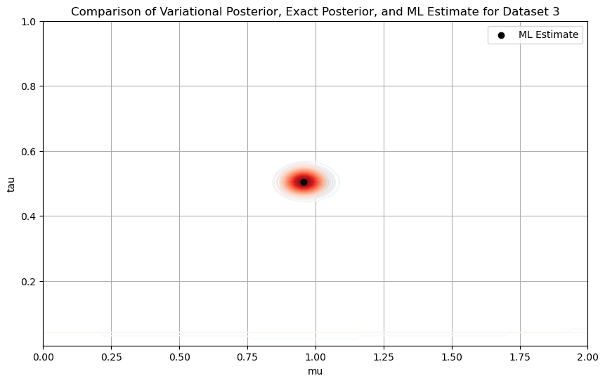

# Coordinate Ascent Variational Inference (CAVI)

## Description

This project focuses on implementing and analyzing Coordinate Ascent Variational Inference (CAVI) for a Bayesian model defined over Gaussian observations with Normal-Gamma prior. The goal is to approximate the posterior distribution using a factorized variational approach and evaluate its quality across synthetic datasets of increasing size.

<p align="center">
  
</p>

*Directed graphical model representing the Bayesian generative process. The latent parameters $\mu$ and $\tau$ are governed by a Normal-Gamma prior. The observed data points $x_n$ are conditionally independent given $\mu$ and $\tau$.*

All inference formulas and update rules used in the implementation were derived manually and are fully documented in an accompanying file, ensuring transparency and a deep understanding of the variational optimization process.

## Key Results

- **Dataset sizes:** $N = 10,\ 100,\ 1000$
- **Objective:** Approximate the posterior over $(\mu,\ \tau)$ using a factorized variational distribution  
- **Evaluation metrics:**
  - Evidence Lower Bound (ELBO) convergence
  - Comparison between variational and exact posteriors
  - Alignment with Maximum Likelihood (ML) estimates

| Dataset Size | Final ELBO | Convergence Iterations | Notes                                                                 |
|--------------|------------|-------------------------|-----------------------------------------------------------------------|
| 10           | -17        | ~140                    | Quick convergence; broader variational approximation                  |
| 100          | -180       | ~150                    | Tighter approximation; closer to the exact posterior                  |
| 1000         | -1800      | ~160                    | Excellent match; confirms convergence to the true posterior           |

- As dataset size increases, the variational approximation improves and more closely matches the exact posterior.
- Both the variational and exact posteriors, as well as the ML estimates, converge toward the true parameter values ($\mu = 1,\ \tau = 0.5$).

## Visual Insights

<p align="center">
  
  
  
</p>

*ELBO convergence across datasets of increasing size*

<p align="center">
  
  
</p>
<p align="center">
  
  
</p>
<p align="center">
  
  
</p>

*Comparisons of the variational distribution (blue contours), exact posterior (red contours), and ML estimates (black dot) for each dataset.*

## Features

- Full implementation of the Coordinate Ascent Variational Inference algorithm
- Manual derivation of update formulas
- Closed-form computation of the Normal-Gamma posterior
- ELBO calculation to monitor variational convergence
- Contour plots to visually compare approximations and exact distributions

## Dataset

Synthetic datasets are generated with:
- True mean ($\mu$) = 1
- True precision ($\tau$) = 0.5
- Sample sizes: $N = 10$, $100$, and $1000$

All samples are drawn from a Normal distribution using the specified parameters.

## File Structure

- `notebook.ipynb`  
  Implementation notebook containing:
  - Data generation
  - ML and posterior computation
  - CAVI implementation
  - Evaluation metrics and visualization

- `derivations.pdf`  
  Detailed mathematical derivations of all variational update equations, ELBO, exact posterior, as well as ML estimates

## Methodology

- **Model**: Gaussian likelihood with a Normal-Gamma prior on $(\mu, \tau)$
- **Inference**:
  - Exact posterior derived analytically
  - Variational approximation assumes $q(\mu,\tau) = q(\mu)\,q(\tau)$
  - ELBO maximized via coordinate ascent updates (manually derived)
- **Evaluation**:
  - Comparison of posteriors using contour plots
  - Assessment of convergence via ELBO
  - Maximum likelihood estimation included for benchmarking
- **Frameworks used**:
  - NumPy for numerical computation
  - SciPy for statistical functions (e.g., digamma)
  - Matplotlib for plotting

## Installation

Install the required dependencies with:

```bash
pip install numpy scipy matplotlib