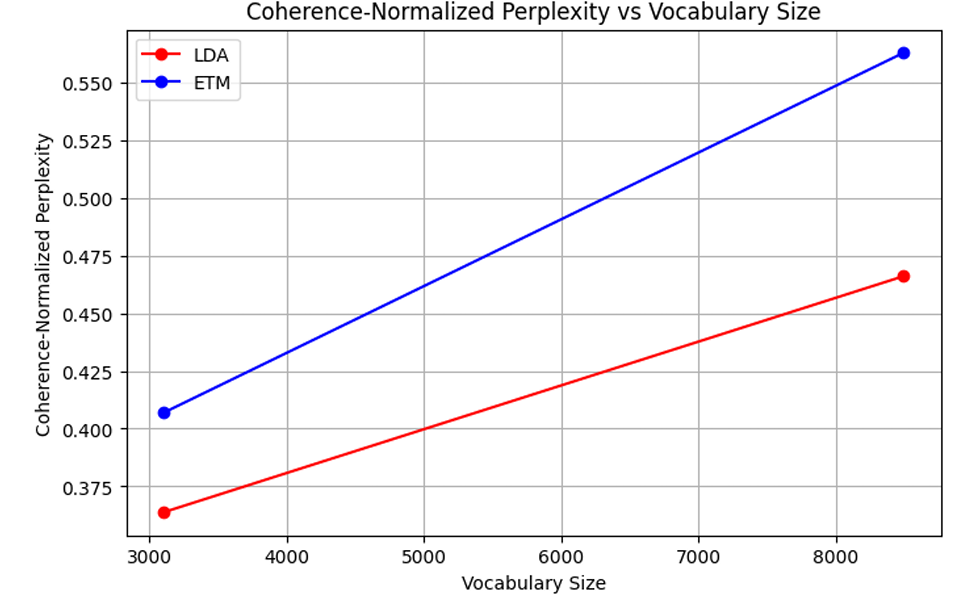
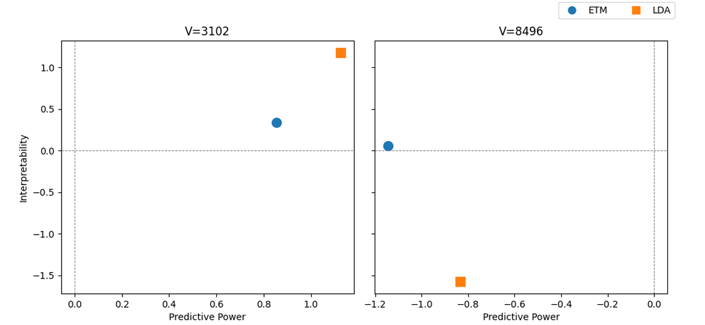

# Embedded Topic Model (ETM) for Document Analysis

## Description

This project implements the **Embedded Topic Model (ETM)**, a modern topic modeling approach that combines the probabilistic strengths of LDA with the representational power of neural word embeddings. ETM models documents as mixtures of topics, with both words and topics embedded in the same semantic space. This allows it to capture meaningful relationships between words, scale to large vocabularies, and improve interpretability.

The codebase follows the structure and methods from the original ETM paper by Dieng et al. (2019) and includes functionality to preprocess text data, train the ETM model, and evaluate it against LDA using coherence, diversity, and perplexity metrics.

## Key Results

The ETM model was successfully implemented and trained on the 20 Newsgroups dataset, and compared against the LDA baseline. While ETM did not consistently outperform LDA in all metrics, it demonstrated several advantages aligned with findings from the original paper.

ETM exhibited superior **interpretability**, particularly with larger vocabularies, thanks to its embedding-based topic representation. The shared vector space between topics and words allowed semantically similar words to be grouped more meaningfully.

However, ETM’s **predictive performance** was more sensitive to training stability and hyperparameter choices. Issues such as exploding gradients required gradient clipping and careful learning rate tuning, which made convergence slower and sometimes less reliable compared to LDA. 

As visualized in the figures below, the model captured the core ideas of ETM and reproduced key qualitative trends from the original work. Our findings confirm ETM’s conceptual advantages but also underscore the importance of careful implementation and tuning to fully realize its potential in practice.

## Visual Insights


<p align="center">
  
</p>

*Coherence-normalized perplexity of LDA and ETM as a function of vocabulary size.*

<p align="center">
  
</p>

*Comparison of ETM and LDA on interpretability vs. predictive power for two vocabulary sizes.*

## Features

- Full ETM implementation in PyTorch
- Word and topic embeddings in a shared vector space
- Variational inference with reparameterization trick
- Evaluation metrics: Perplexity, Predictive Power, Topic Coherence (TC), Topic Diversity (TD), and Interpretability
- LDA benchmark for comparison

## Datasets

The project uses a preprocessed version of the **20 Newsgroups** dataset. Document-term matrices are created after token filtering, stopword removal, and frequency thresholding. Two vocabulary sizes are explored:

- **Vocab size = 3102** (min_df = 100)
- **Vocab size = 8496** (min_df = 30)

## File Structure

- `main.py` – Runs training and evaluation of ETM
- `model.py` – ETM architecture and training logic
- `data_process.py` – Loads preprocessed BoW data and builds document-term matrices
- `utils.py` – Evaluation metrics and visualization helpers
- `report.pdf` – Detailed explanation of model, methods, experiments, and results
- `paper.pdf` – Reference paper
- `data/` – Pre-processed BoW data

## Methodology

- **Model**:
  - Encoder: Maps bag-of-words input to variational parameters for topic proportions
  - Decoder: Reconstructs document distribution using learned topic-word matrix
  - Topic and word embeddings are jointly trained in a 300-dimensional space

- **Inference**:
  - Variational distribution over document-topic proportions
  - Reparameterization trick enables efficient backpropagation
  - Optimization via stochastic gradient descent (Adam optimizer, 0.001 learning rate, 100 batch size, and weight decay)

- **Evaluation**:
  - **Perplexity** via document completion task
  - **Topic Coherence (TC)** using Normalised Pointwise Mutual Information (NPMI) between top words
  - **Topic Diversity (TD)** as uniqueness of top words across topics
  - **Interpretability** as $e^{(\text{TC} \cdot \text{TD})}$

## Installation

To install required packages:

```bash
pip install torch numpy matplotlib scipy scikit-learn