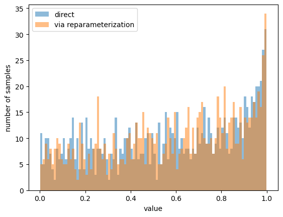
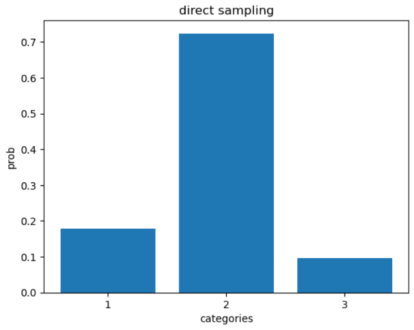
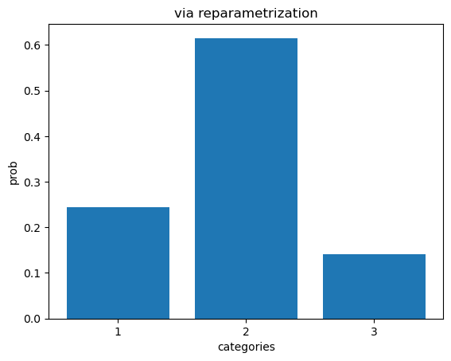

# Reparameterization of Common Distributions

## Description

This project demonstrates how to apply the reparameterization trick to two non-Gaussian distributions commonly used in probabilistic models — the **Beta** and **Dirichlet** distributions. These techniques allow gradient-based optimization in models like Variational Autoencoders (VAEs), where standard backpropagation would otherwise be inapplicable due to sampling from non-differentiable distributions.

The reparameterizations are implemented in PyTorch using differentiable approximations:
- **Kumaraswamy distribution** to approximate Beta
- **Softmax-Gaussian approximation** for the Dirichlet

## Key Results

This project provides efficient, differentiable samplers for:

- **Beta distribution** using inverse CDF of the Kumaraswamy distribution
- **Dirichlet distribution** using the softmax of a multivariate normal

These methods allow **reparameterization gradients** for backpropagation through stochastic nodes—essential for variational autoencoders and similar models.

| Distribution | Method                 | Notes                                                 |
|--------------|------------------------|--------------------------------------------------------|
| **Beta**     | Kumaraswamy Inversion  | Efficient inverse-CDF sampling with differentiability |
| **Dirichlet**| Logistic Normal Approx.| Based on Laplace approximation in softmax basis       |


## Visual Insights

### Beta Distribution

<p align="center">
  
</p>

### Dirichlet Distribution

<p align="center">
  
  
</p>

*Samples drawn using standard and reparameterized techniques for both Beta and Dirichlet distributions.*


## Features

- Direct sampling vs. reparameterized sampling comparisons
- Inverse-CDF sampling using Kumaraswamy distribution
- Logistic-normal approximation of the Dirichlet distribution
- Visual inspection through histogram and bar plots
- Differentiable sampling schemes enabling gradient-based optimization

## File Structure

- `notebook.ipynb`  
  Jupyter notebook demonstrating:
  - Derivation-based reparameterization
  - Sampling and plotting for Beta and Dirichlet
  - Visual comparisons and validation

- `derivations.pdf`  
  Contains detailed mathematical derivations for the reparameterization techniques used.

## Methodology

- **Reparameterization Trick**:  
  Enables low-variance gradient estimation by expressing random variables as deterministic functions of noise.

- **Beta via Kumaraswamy**:
  - Approximates the Beta distribution with a differentiable form
  - Allows direct inverse transform sampling

- **Dirichlet via Logistic-Normal**:
  - Based on Laplace approximation in softmax basis (Srivastava & Sutton, 2017)
  - Allows sampling via Gaussian reparameterization

- **Tools**:
  - PyTorch for math and simulation
  - Matplotlib for plotting

## Installation

To install the required dependencies:

```bash
pip install torch matplotlib
