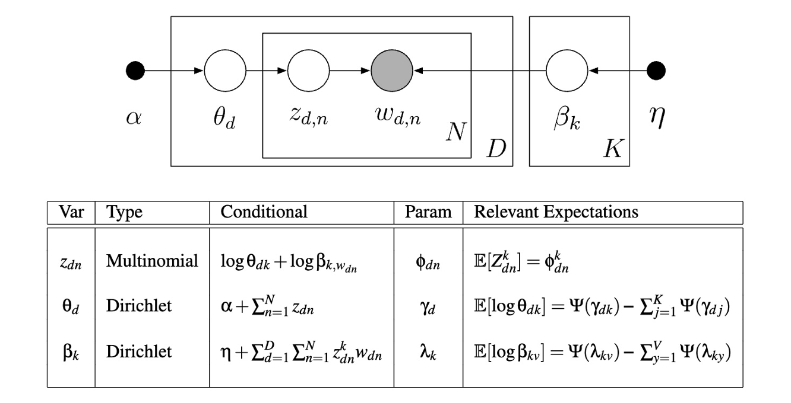

# Stochastic Variational Inference for Latent Dirichlet Allocation (LDA)

## Description

This project implements **Stochastic Variational Inference (SVI)** for the **Latent Dirichlet Allocation (LDA)** model, based on the algorithm by Hoffman et al. (2013). The objective is to infer hidden topic structures in document collections using scalable, mini-batch variational updates. 

Both SVI and Coordinate Ascent Variational Inference (CAVI) were tested on synthetic datasets to evaluate convergence behavior and efficiency.

<p align="center">
  
</p>

*Graphical model of LDA: words $w_{d,n}$ depend on topics $z_{d,n}$, which are sampled from per-document topic proportions $\theta_d$, with global topic-word distributions $\beta_k$.*

## Key Results

Experiments were conducted on synthetic datasets with varying document counts and topic counts. The table below reports the final ELBO values and runtime for each setting.


### Tiny Dataset
| Inference Method | Final ELBO       | Training Time       |    
|---------------|------------------|----------------------|
| **CAVI**      | -3300            | 3.15 sec               
| **SVI**         | -3500           | 0.465 sec      

### Small Dataset

| Inference Method | Final ELBO       | Training Time      |
|---------------|------------------|-----------------------------------|
| **CAVI**      | -111000            | 86.6 sec         
| **SVI**         | -113000          | 12.3 sec     

### Medium Dataset (only one iteration was performed)

| Inference Method | Training Time        |
|---------------|----------------------|
| **CAVI**      | ~127 sec               |
| **SVI**        | ~3.56 sec  

- Both methods consistently achieve similar performance, with ***CAVI*** reaching slightly higher ELBO values.
- **SVI** generalizes much better to large datasets and high topic counts using mini-batch optimization.

## Visual Insights
<p align="center">
  
  
</p>
*ELBO convergence for both ***CAVI*** and ***SVI***   across datasets of increasing size*


## Features

- Full SVI implementation for LDA using noisy gradient updates
- Side-by-side benchmarking against CAVI
- Synthetic data generation and ELBO-based convergence analysis
- Efficient handling of large-scale data

## Datasets

Three synthetic datasets of increasing scale (**tiny**, **small**, and **medium**) were generated to evaluate model performance under varying conditions. Their characteristics are summarized below:

-   **Vocabulary size:** 50 (tiny & small), 500 (medium)
    
-   **Number of documents:** 50 (tiny), 1,000 (small), 10,000 (medium)
    
-   **Number of topics:** 2 (tiny), 3 (small), 5 (medium)

## File Structure

- `notebook.ipynb`  
  Main notebook implementing:
  - Synthetic dataset creation
  - CAVI and SVI algorithms
  - ELBO tracking and runtime evaluation
- `papers/` – Reference papers consulted for the implementation


## Methodology

- **Model**: Latent Dirichlet Allocation with Dirichlet priors over document-topic ($\theta$) and topic-word ($\beta$) distributions
- **Inference**:
  - Mean-field variational family: $q(\theta, z, \beta) = \prod_d q(\theta_d)\prod_n q(z_{dn})\prod_k q(\beta_k)$
  - **SVI**: Global updates via mini-batches (batch size of 5 for the tiny dataset and 100 for the others) with decaying learning rate
  - **CAVI**: Full-batch coordinate ascent inference
- **Evaluation**:
  - Tracked ELBO across iterations
  - Measured convergence speed and computational cost
- **Tools**:
  - NumPy for matrix operations
  - Matplotlib for ELBO plots

## Installation

To install the required dependencies:

```bash
pip install numpy matplotlib scipy
