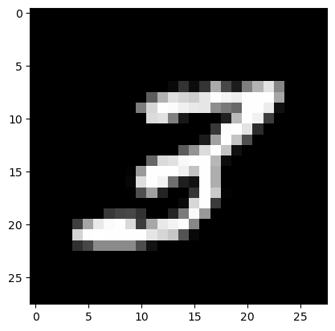
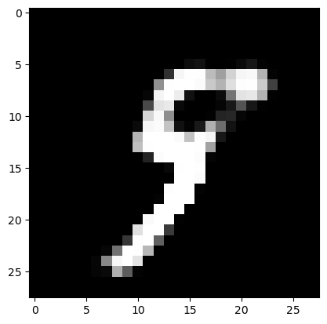

# Variational Autoencoder (VAE) for MNIST Latent Representation and Image Generation

## Description

This project implements a **Variational Autoencoder (VAE)** to learn a latent representation of handwritten digits from the **MNIST** dataset. The model captures a compressed latent space through which new digits can be generated by decoding points sampled from the learned posterior.


<p align="center">
  
</p>

*VAE architecture: Encoder compresses input images to latent space, Decoder reconstructs from latent variables.*

## Key Results
### Image Generation

The VAE successfully learned meaningful latent representations of the MNIST dataset, enabling high-quality image reconstruction and generation.

- **Reconstruction**: The decoder accurately reconstructs digit images from the latent embeddings, demonstrating that the latent space captures the essential structure of the input data.
- **Generation**: By sampling Gaussian noise $N(0,I)$ and decoding it, the VAE is able to synthesize realistic digit images, validating the expressiveness of the learned generative model.

### Latent Space
Importantly, we compared the effect of using **Kullback-Leibler divergence (KL)** versus **Maximum Mean Discrepancy (MMD)** in the loss function:

- **MMD**:  Results in a more structured and semantically meaningful latent space. Similar digits are clustered together, and the model better preserves local relationships in the data. While the global shape of the distribution differs from the standard normal, the representation is more useful for generation.
- **KL**: Enforces a strict match between the approximate posterior and the prior, often resulting in compressed or underutilized latent regions. While this promotes regularity, it can limit the model’s ability to represent complex local variations in the data.


## Visual Insights

### Image Generation
<p align="center">
  
  
</p>
*Input image from the test dataset (left) and its reconstruction (right).*

<p align="center">
  
  
</p>
*Images generated from Gaussian noise by the decoder.*

### Latent Space
<p align="center">
  
  
</p>
*Latent space structure using KL (left) and MMD (right) in the loss function.*

## Features

- VAE with encoder and decoder neural networks
- Latent dimensionality configurable
- Reparameterization trick for backpropagation through stochastic nodes
- Trained on the MNIST dataset using binary cross-entropy and KL divergence/MMD

## Datasets

The project uses the **MNIST** dataset:

- 60,000 training images
- 10,000 test images
- 28x28 grayscale handwritten digits
- Normalized to [0, 1]

## File Structure

- `notebook.ipynb`  
  Jupyter notebook implementing:
  - VAE architecture (encoder, decoder)
  - ELBO loss calculation
  - Model training, reconstruction, and image generation
  - Visualization of latent space and samples
- `paper.pdf` – Reference paper

## Methodology

- **Model**:
  - Encoder: MLP maps image → latent mean and log variance
  - Reparameterization trick to ensure differentiability through latent sampling:  
    $z=\mu +\sigma \cdot \epsilon$ where $\epsilon \sim \mathcal{N}(0, I)$
  - Decoder: MLP maps latent vector back to image space

- **Loss (ELBO)**:
  - Reconstruction loss: Binary cross-entropy
  - KL divergence between posterior $q(z|x)$ and prior $p(z)$
  - MMD between posterior $q(z|x)$ and prior $p(z)$ using the kernel trick

- **Training (using Stochastic Gradient Descent)**:
  - Optimizer: Adam
  - Learning rate: 0.001
  - Epochs: 5
  - Batch size: 100

- **Tools**:
  - PyTorch for model definition and training
  - Matplotlib for visualization
  - NumPy for array operations
  - Sickit Learn for 2D manifold visualization

## Installation

To install the required dependencies:

```bash
pip install torch torchvision numpy tqdm sklearn matplotlib
