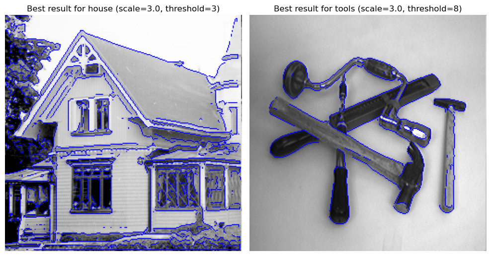
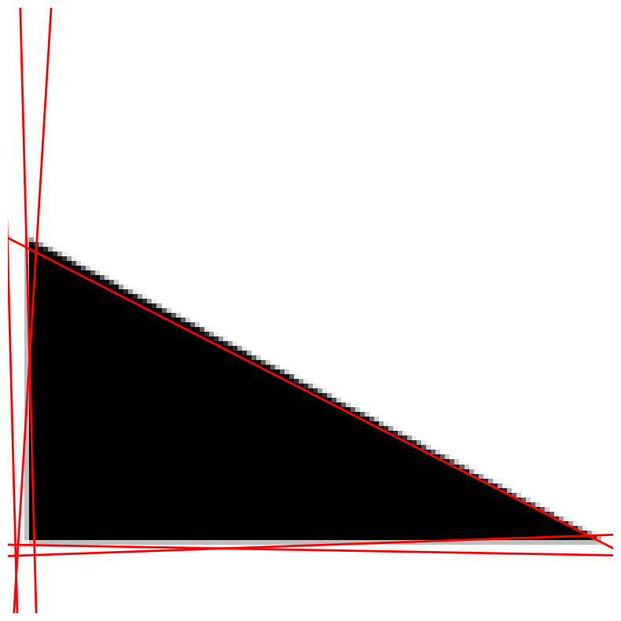
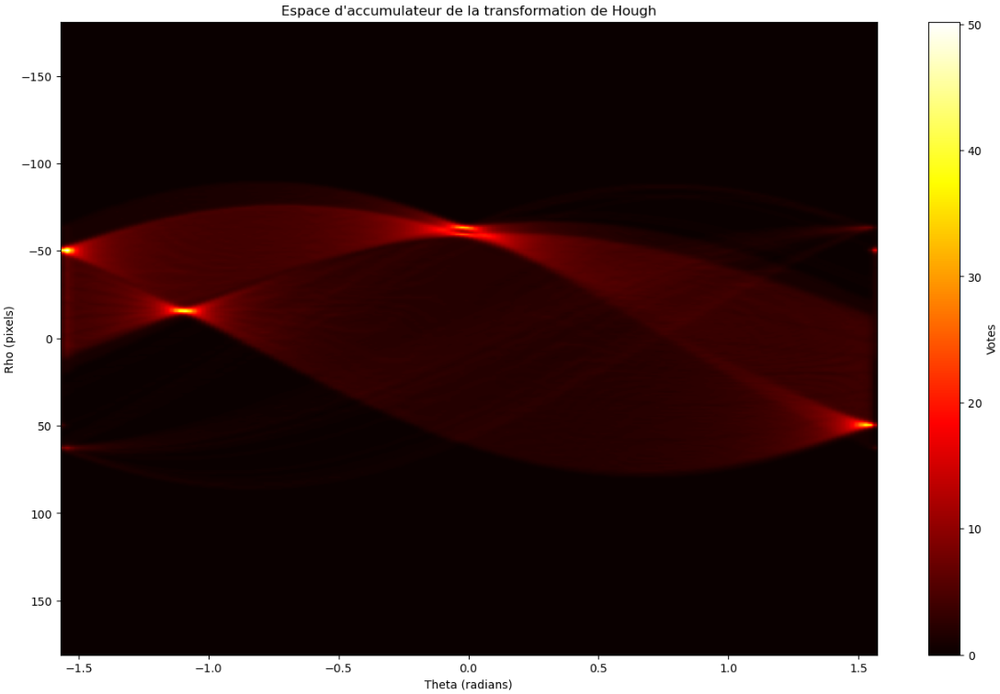
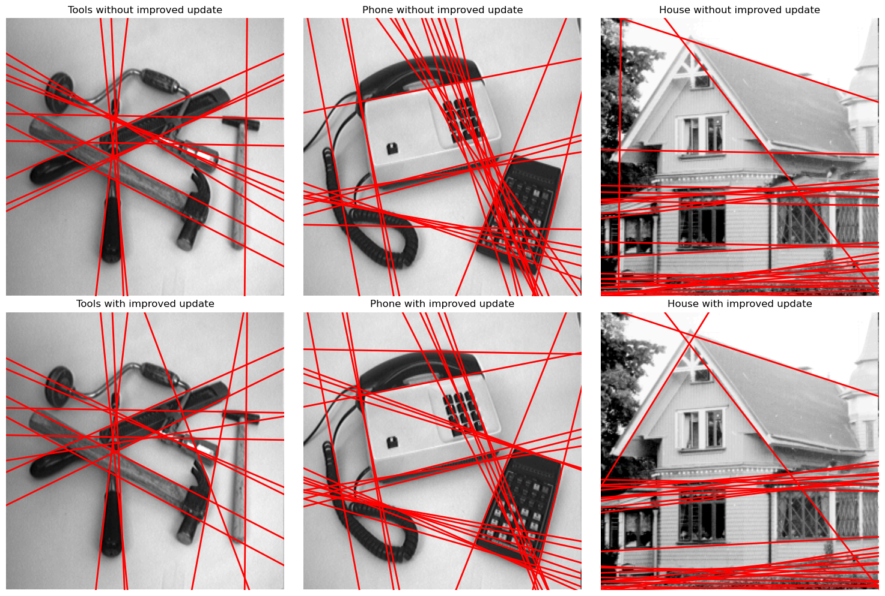

# Edge Detection and Hough Transform

## Description

This project focuses on **edge detection using differential operators** and **line extraction using the Hough transform**. It implements multiscale edge detection by convolving images with Gaussian-derivative filters, capturing both first and second-order features. The Hough transform is then used to identify strong linear structures in images based on edge responses.

Two versions of the Hough transform are included:
- **Standard Hough Transform**: Based on edge point voting.
- **Gradient-weighted Hough Transform**: Incorporates magnitude and alignment of gradients for improved robustness.

## Key Results

- The combination of multiscale edge detection with zero-crossings and gradient-based thresholding enables robust detection of complex structures in images.
- Using **gradient alignment in the Hough transform** improves precision by favoring well-aligned edge directions.
- Fine-tuning parameters like smoothing scale and gradient thresholds is crucial for isolating true edges and enhancing accumulator quality.

## Visual Insights

<p align="center">
  
</p>

*Detected edges overlaid on the image using differential geometry descriptors.*


<p align="center">
  
</p>

<p align="center">
  
</p>

*Detected lines overlaid on a toy image (top), and corresponding points in the Hough space (bottom).*


<p align="center">
  
</p>

*Detected lines overlaid on the image using Hough transform for two different accumulator incrementation function (the improved version taking into account gradient alignment).*

(See notebook for full visualizations.)

## Features

- Derivative filters (first-, second-, third-order)
- Convolution via `scipy.signal.convolve2d`
- Gaussian smoothing using FFT-based and analytic filters
- Zero-crossing detection for edge localization
- Hough transform for line detection
  - Standard and gradient-based variants
  - Accumulator visualization and maxima extraction

## File Structure

- `core.py` – Main functions for computing derivatives, edge maps, and Hough lines
- `Functions.py` – Utility functions for filtering, display, smoothing, and noise
- `gaussfft.py` – FFT-based Gaussian convolution
- `notebook.ipynb` – Main notebook with experiments and visualizations
- `Images-npy/` – Folder containing images that are being used in the study

## Methodology

- **Edge Detection**:
  - Use discrete Gaussian smoothing followed by spatial convolution with derivative masks
  - Compute edge strength:  $\| \nabla I \|$
  - Identify edges via zero-crossings in the Laplacian or second derivative terms
  - Apply optional thresholding for noise suppression

- **Hough Transform**:
  - Map edge coordinates to parameter space  $(\rho, \theta)$
  - Vote in an accumulator array
  - Smooth accumulator using Gaussian convolution
  - Extract top local maxima to identify most significant lines
  - Enhanced version weighs votes using gradient direction alignment

## Installation

To install required packages:

```bash
pip install numpy matplotlib scipy