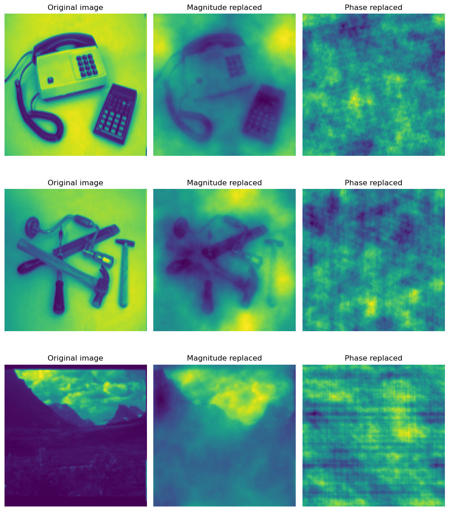
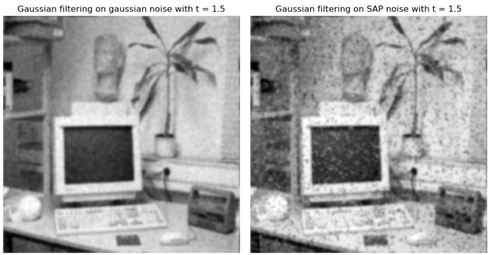
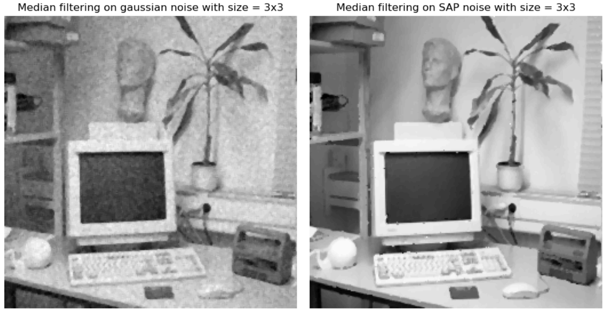
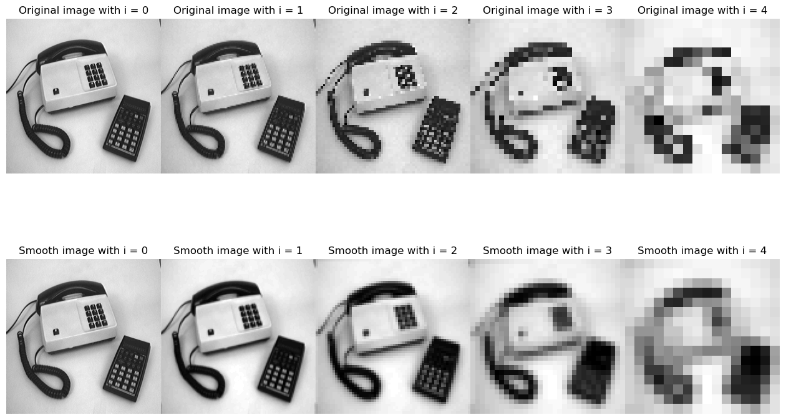

# Filtering Operations

## Description

This project explores the **Discrete Fourier Transform (DFT)** and its applications in image processing, particularly in **frequency-based filtering**. Through a series of guided experiments, we analyze the relationships between spatial and frequency domains, design and apply Gaussian filters via FFT, and compare filtering techniques for noise reduction and subsampling.

The study provides both theoretical understanding and practical experience with image smoothing, frequency interpretation, and aliasing effects in subsampled images.


## Key Results

- The spatial sine wave patterns correspond directly to specific positions in the Fourier domain, with their **direction and frequency controlled by coordinates**.
- **Aliasing effects** become visible when crossing Nyquist limits; high-frequency components wrap and produce artifacts.
- **Magnitude** in the Fourier domain describes the intensity of frequency components, providing insight into contrast and texture. It reflects the distribution of gray-level differences across the image.
- **Phase** encodes the spatial layout and structure of features—preserving edge positions and object locations. It's critical for reconstructing coherent images from frequency data.
- **Gaussian filters**, implemented via FFT, behave consistently with theory: their spatial variance matches expectations and their frequency response narrows as variance increases.
- When comparing filtering techniques:
  - **Gaussian filtering** performs best for natural noise smoothing.
  - **Median filtering** is most effective against salt-and-pepper noise.
  - **Ideal low-pass filters** offer strong noise reduction but can introduce artifacts.
- **Smoothing before subsampling** significantly reduces aliasing, though it also softens edges—highlighting a tradeoff between clarity and fidelity.


## Visual Insights

<p align="center">
  
</p>

*Information contained in the magnitude and phase of the Fourier transform.*

<p align="center">
  
</p>

<p align="center">
  
</p>

*Comparison of smoothing filters applied to noisy images.*

<p align="center">
  
</p>

*Subsampling effects on raw vs. pre-smoothed images.*

(See notebook for full visualizations.)

## Features

- Fourier transform analysis using synthetic frequency signals
- Inverse FFT to interpret individual components in spatial domain
- Impulse response visualization for Gaussian filters
- Comparison of filter types on noisy images
- Subsampling experiments with and without prior smoothing

## File Structure

- `fftwave.py` – Visualizes sine patterns from specific Fourier domain points
- `gaussfft.py` – Applies Gaussian convolution via FFT
- `Functions.py` – Utility functions for displaying and manipulating images
- `notebook.ipynb` – Main notebook containing all experiments and plots
- `Images-npy/` – Folder containing images that are being used in the study

## Methodology

- **FFT-Based Filtering**:
  - Transform image and filter to frequency domain
  - Perform element-wise multiplication
  - Transform back via inverse FFT
- **Gaussian Kernel Design**:
  - Constructed in spatial domain, centered using `fftshift`
  - Variance checked against theoretical expectation
- **Noise Handling**:
  - Gaussian noise filtered using smoothing
  - Salt-and-pepper noise addressed with median filters
- **Subsampling Strategy**:
  - Tested raw vs. filtered images
  - Explored aliasing and resolution loss

## Installation

To install required dependencies:

```bash
pip install numpy matplotlib scipy
