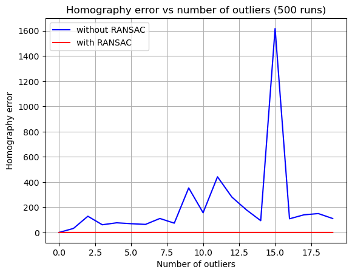
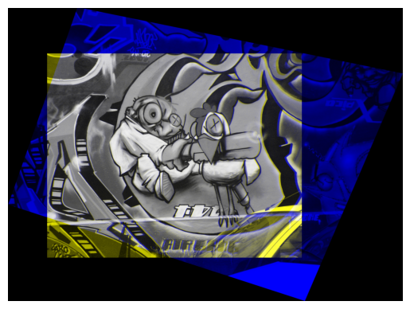
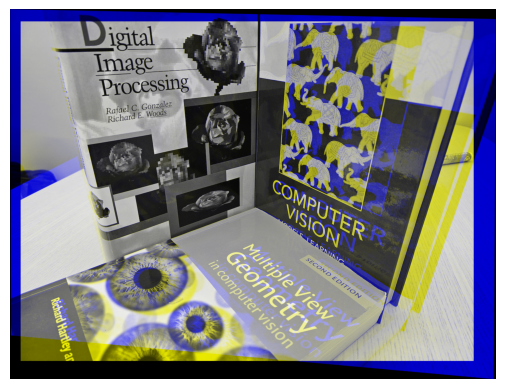
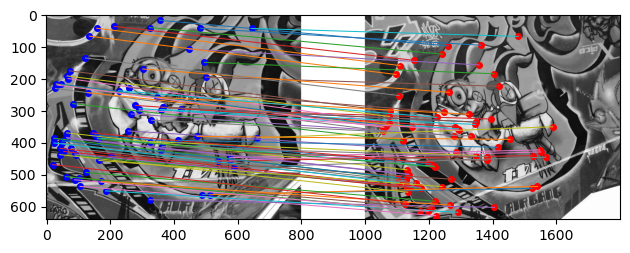
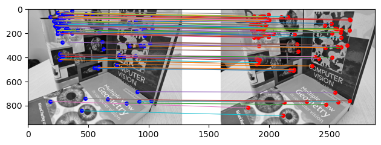
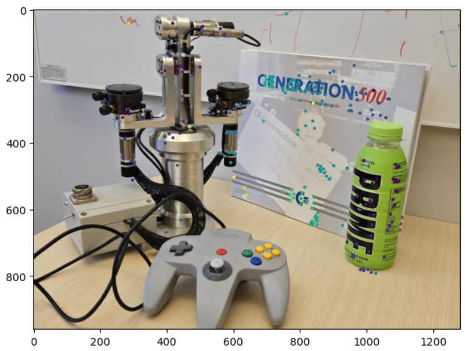
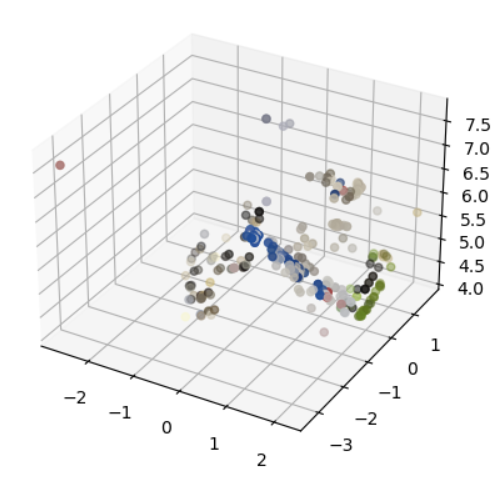

# Image Matching & 3D Reconstruction

## Description

This project explores **feature-based image matching** and **3D reconstruction** using **homographies** and **fundamental matrices**. The pipeline begins by extracting and matching SIFT features across image pairs, followed by robust estimation using **RANSAC**. Depending on scene geometry, either a **homography** (for planar scenes) or **fundamental matrix** (for general scenes) is computed. The estimated model is then used for **image alignment** or **triangulation** of 3D points.

This study demonstrates how model selection, feature distribution, and noise affect the stability and interpretability of results.

## Key Results

- Homography estimation is highly sensitive to noise and outliers; using many well-distributed feature points and **RANSAC** significantly improves robustness and accuracy.
- RANSAC leads to much more stable homographies by rejecting outliers early on, unlike direct least-squares estimation.
- **Homography estimation works well for planar scenes**, but performs poorly when applied to images containing significant 3D structure or depth variation.
- **Fundamental matrix estimation** requires more iterations due to its higher point requirement (8 vs. 4) and greater sensitivity to mismatches.
- When reconstructing 3D geometry from stereo images, results vary significantly depending on camera calibration and feature quality.
- With appropriate constraints, varying focal length during triangulation can give insights into **scene geometry**, such as estimating angles between object surfaces.

## Visual Insights

<p align="center">
  
</p>
*Homography error VS number of outliers with and without RANSAC.*

<p align="center">
  
</p>
<p align="center">
  
</p>

*Image matching using homographies and RANSAC.*


<p align="center">
  
</p>
<p align="center">
  
</p>

*Image matching using fundamental matrices and RANSAC.*

<p align="center">
  
</p>
<p align="center">
  
</p>

*3D reconstruction using triangulated points and a recovered fundamental matrix.*

(See notebook for full visualizations.)

## Features

- Linear and RANSAC-based estimation of **homography** and **fundamental matrix**
- Feature extraction and matching using OpenCV SIFT
- Robustness testing with synthetic outliers and image noise
- Basic triangulation for **3D point cloud reconstruction**
- Image warping for **homography-based alignment**

## Datasets

- Synthetic image point correspondences with controlled noise/outliers
- Real image pairs with flat (e.g., walls) and general 3D scenes

## File Structure

- `homography.py` – Homography estimation and RANSAC implementation
- `fmatrix.py` – Fundamental matrix estimation (normalized and unnormalized)
- `triangulation.py` – Triangulation for 3D reconstruction
- `utils.py`, `plots.py` – Visualization and helper functions
- `notebook.ipynb` – Full pipeline: feature matching, estimation, reconstruction
- `images/` – Folder containing real image pairs

## Methodology

- **Homography estimation** via least-squares and constrained eigenvector computation
- **RANSAC** for outlier rejection in both homography and fundamental matrix estimation
- **Fundamental matrix** from 8-point algorithm using singular value decomposition
- **Triangulation** of matched keypoints under known or assumed camera intrinsics

## Installation

To install required packages:

```bash
pip install numpy matplotlib opencv-python scipy